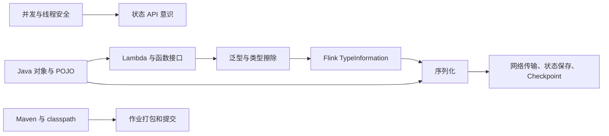

# Flink 1.17 学习前的 Java 基础详解

## 这套笔记解决什么问题

学习 Flink 时，困难通常不只是 API 多。更常见的情况是：代码看起来只有几行，但背后同时涉及 Java 接口、Lambda、泛型、类型擦除、对象序列化、并发和异常处理。

这套笔记不是完整的 Java 语言手册，而是一条面向 Flink 1.17 的 Java 复习路线。目标是让你能够：

1. 看懂常见 Flink DataStream 示例。
2. 独立编写 `map`、`flatMap`、`filter`、`keyBy` 等算子逻辑。
3. 理解为什么 Flink 强调 POJO、泛型类型信息和序列化。
4. 遇到类型推断、序列化和状态相关报错时，知道从哪里开始排查。
5. 为后续学习状态、窗口、时间语义、Checkpoint 和 Kafka Connector 打好基础。

## 推荐开发环境

针对 Flink 1.17，建议使用：

- JDK 11
- Maven 3
- IntelliJ IDEA
- Flink 1.17.2

Flink 1.17 可以使用 Java 8 或 Java 11，但 Java 8 已经被标记为 deprecated。学习阶段优先选择 Java 11。

## 阅读顺序

| 顺序 | 章节 | 重要程度 | 学习目标 |
| --- | --- | --- | --- |
| 01 | [[01-类、对象、封装与不可变性]] | 必学 | 看懂事件对象和配置对象 |
| 02 | [[02-接口、抽象类、继承与多态]] | 必学 | 理解 Flink 函数接口和 RichFunction |
| 03 | [[03-Lambda、函数式接口与方法引用]] | 必学 | 熟练编写常用算子 |
| 04 | [[04-泛型、类型擦除与Flink类型信息]] | 必学 | 理解 `TypeHint` 和 `.returns()` |
| 05 | [[05-集合、Stream-API与DataStream的区别]] | 必学 | 掌握本地集合处理，避免混淆两套 API |
| 06 | [[06-POJO、JavaBean、Tuple与序列化]] | 必学 | 正确设计流中的数据类型 |
| 07 | [[07-异常处理、脏数据与资源管理]] | 重要 | 处理解析失败和外部资源 |
| 08 | [[08-内部类、static、final与闭包捕获]] | 重要 | 避免常见序列化错误 |
| 09 | [[09-并发、线程安全与Flink状态意识]] | 重要 | 建立分布式计算的正确直觉 |
| 10 | [[10-Maven、JAR、classpath与依赖作用域]] | 重要 | 理解作业为什么能编译却未必能运行 |
| 11 | [[11-综合练习-订单实时统计]] | 实战 | 串联全部知识点 |
| 12 | [[12-复习检查表]] | 复习 | 检查每类知识点是否真正掌握 |
| 13 | [[13-容易漏掉但高频的Java细节]] | 重要 | 补齐包装类型、字符串、数组、枚举和金额精度 |
| 14 | [[14-掌握度测试题与详细解析]] | 验收 | 通过分层题目检验理解程度 |

## 学习方式

每篇建议分三轮阅读：

1. 第一轮只理解概念和示例，不追求记忆全部细节。
2. 第二轮自己手写示例，不要复制粘贴。
3. 第三轮完成每篇末尾的自测题，并用自己的话解释答案。

## 一张总览图

## 学完后的验收标准

如果你可以清楚回答下面的问题，就可以开始系统学习 Flink DataStream API：

1. `map`、`flatMap` 和 `filter` 的输入输出关系是什么？
2. 为什么 Lambda 中捕获的外部对象可能导致 Flink 作业提交失败？
3. 什么样的 Java 类可以被 Flink 识别为 POJO？
4. Java 泛型擦除是什么？为什么有时需要 `.returns(new TypeHint<...>() {})`？
5. 为什么不应该在 Flink 算子中用普通 `HashMap` 随意保存业务状态？
6. `provided` 依赖为什么常见于提交到 Flink 集群的作业？

## 常见问题导航

阅读过程中遇到疑问时，可以先按关键词跳转：

| 疑问 | 建议阅读 |
| --- | --- |
| 为什么 Flink POJO 常写 setter，看起来不够安全？ | [[01-类、对象、封装与不可变性#11. 阅读时常见问题]] |
| 为什么不建议复用同一个事件对象？ | [[01-类、对象、封装与不可变性#11. 阅读时常见问题]] |
| Lambda 和匿名内部类有什么关系？ | [[03-Lambda、函数式接口与方法引用#10. 阅读时常见问题]] |
| `map`、`flatMap` 和 `filter` 到底怎么区分？ | [[03-Lambda、函数式接口与方法引用#10. 阅读时常见问题]] |
| Java 编译器知道泛型，为什么 Flink 还要 `TypeHint`？ | [[04-泛型、类型擦除与Flink类型信息#13. 阅读时常见问题]] |
| Java Stream 和 Flink DataStream 为什么长得很像？ | [[05-集合、Stream-API与DataStream的区别#11. 阅读时常见问题]] |
| 实现了 `Serializable`，为什么还要关心 POJO？ | [[06-POJO、JavaBean、Tuple与序列化#12. 阅读时常见问题]] |
| 为什么不能用普通 `HashMap` 保存业务累计值？ | [[09-并发、线程安全与Flink状态意识#12. 阅读时常见问题]] |
| IDE 能运行，提交集群为什么报缺少类？ | [[10-Maven、JAR、classpath与依赖作用域#12. 阅读时常见问题]] |

每篇正文末尾都有“阅读时常见问题”。建议先读正文，再用问答检查自己是否真的理解了原因。

## 最终验收方式

完成正文学习后，进入 [[14-掌握度测试题与详细解析]]。

这套测试包含：

- 10 道概念口述题。
- 10 道代码判断题。
- 5 道 Flink 场景选择题。
- 5 道运行结果解释题。
- 1 道综合设计题。

每道题都附有可折叠的详细解析和错题回查链接。先独立回答，再展开答案。只记住结论但说不出原因，说明知识还没有真正变成自己的。
