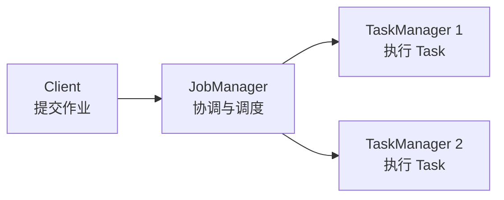

# Flink 作业提交与集群角色

## 1. 三个核心角色

Flink 集群至少需要理解三个角色：

```text
Client
JobManager
TaskManager
```



## 2. Client 做什么

Client 是提交作业的一方。执行：

```bash
flink run -d \
  -c com.atguigu.flink.architecture.Flink01_Parallelism \
  /tmp/Flink-thin.jar \
  host.docker.internal \
  8888
```

Client 会：

1. 读取 JAR。
2. 加载指定入口类。
3. 调用入口类的 `main()`。
4. 根据 DataStream API 构建作业图。
5. 将 JobGraph 提交给 JobManager。

注意：Client 调用 `main()`，并不代表所有算子都在 Client 中持续执行。真正的数据处理任务通常由 TaskManager 执行。

## 3. JobManager 做什么

JobManager 是集群控制中心，主要负责：

- 接收作业。
- 调度 Task。
- 管理 slot。
- 协调 checkpoint。
- 处理失败恢复。
- 向 Web UI 提供集群与作业状态。

当前 Docker 环境的 JobManager：

```text
容器名：jobmanager
Web UI：http://localhost:8081
```

## 4. TaskManager 做什么

TaskManager 是工作进程，负责实际执行算子任务。

当前 Docker 环境中有：

```text
taskmanager1
taskmanager2
```

查看日志：

```bash
docker logs -f taskmanager1
docker logs -f taskmanager2
```

当代码使用：

```java
sumDs.print();
```

输出通常出现在 TaskManager 日志，而不是 JobManager 日志，也不是 Web UI 页面。

## 5. slot 是什么

slot 是 TaskManager 中用于分配任务资源的逻辑单位。

当前环境：

```text
TaskManager 数量：2
每个 TaskManager slot：4
总 slot：8
```

查看 Web UI：

```text
http://localhost:8081
```

## 6. 并行度是什么

示例代码：

```java
env.setParallelism(1);

DataStreamSource<String> ds = env.socketTextStream(socketHost, socketPort);

ds.flatMap(...).setParallelism(2)
  .keyBy(...)
  .sum("count").setParallelism(3)
  .print().setParallelism(4);
```

作业中的算子并行度：

| 算子 | 并行度 |
|---|---:|
| Socket Source | 1 |
| FlatMap | 2 |
| Keyed Aggregation | 3 |
| Print Sink | 4 |

Task 总数量：

```text
1 + 2 + 3 + 4 = 10
```

但实际 slot 占用并不一定等于 10，因为 Flink 可以通过 operator chaining 与 slot sharing 共享资源。

当前实测：

```text
总 slot：8
可用 slot：4
占用 slot：4
运行中的 task：10
```

这说明多个 task 可以共享 slot。

## 7. 本地 MiniCluster 与 Docker Session Cluster

### 7.1 本地 MiniCluster

IDEA 直接运行：

```java
StreamExecutionEnvironment.getExecutionEnvironment(conf)
```

通常会在当前 JVM 中创建本地执行环境。

示例设置：

```java
conf.setInteger("rest.port", 5678);
```

Web UI：

```text
http://localhost:5678
```

### 7.2 Docker Session Cluster

Docker 中已经运行：

```text
jobmanager
taskmanager1
taskmanager2
```

通过 `flink run` 提交作业后，Web UI：

```text
http://localhost:8081
```

## 8. 为什么 `rest.port=5678` 需要谨慎设置

本地运行时：

```java
conf.setInteger("rest.port", 5678);
```

用于启动本地 Web UI，很方便。

但是通过 `flink run` 提交到 Docker 集群时，这个配置可能覆盖 Client 应连接的 REST 地址，导致 Client 错误地尝试连接：

```text
http://0.0.0.0:5678
```

报错：

```text
Connection refused: /0.0.0.0:5678
```

因此当前代码只在无参数本地运行时设置该端口：

```java
if (args.length == 0) {
    conf.setInteger("rest.port", 5678);
}
```

Docker 提交时会传入 socket 参数，因此不会覆盖集群 REST 配置。

## 9. 一个 JAR 中多个 `main()` 会怎样

JAR 可以包含：

```text
Flink01_Parallelism.main()
Flink02_OperatorChain.main()
Flink03_TaskSlots.main()
```

集群不会扫描并自动执行所有入口。

本次执行哪个入口，由 `-c` 决定：

```bash
flink run -c com.atguigu.flink.architecture.Flink01_Parallelism job.jar
```

Web UI 上传 JAR 时，在 `Entry Class` 中填写同样的完整类名。

## 10. 常用管理命令

查看作业：

```bash
docker exec jobmanager flink list
```

取消作业：

```bash
docker exec jobmanager flink cancel <JobID>
```

查看 JobManager 日志：

```bash
docker logs -f jobmanager
```

查看 TaskManager 日志：

```bash
docker logs -f taskmanager1
docker logs -f taskmanager2
```
