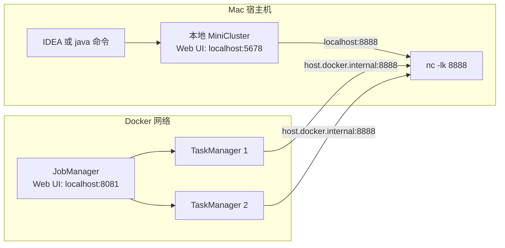

# Flink 本地开发与 Docker 集群部署知识地图

> 这套笔记用于解释一个 Flink Java 作业从源码到运行的完整过程，并记录本地 IDEA 运行、Docker 集群提交、Web UI、依赖 scope、thin JAR、网络地址与 Java 版本兼容等问题。

## 1. 为什么需要学习这部分

在学习 Flink API 时，很容易只关注 `map`、`flatMap`、`keyBy`、`sum` 等算子。但是一个作业真正运行起来，还涉及 Java、Maven、Flink 集群和 Docker 四个层次。

典型问题包括：

- 为什么 IDEA 中可以编译，但运行时报 `NoClassDefFoundError`？
- 为什么 REST API 可以访问，但 Flink Web UI 根页面显示 `Not found: /`？
- 为什么本机安装了 Java 17，Docker 中仍然是 Java 11？
- 为什么 Docker 容器不能使用 `localhost` 访问 Mac 上的 `nc -lk 8888`？
- 为什么一个 JAR 中可以包含多个 `main()`，但集群只执行其中一个？
- thin JAR 和 fat JAR 分别适合什么场景？

这些问题本质上都在讨论：**代码、依赖、运行环境与网络边界如何协作。**

## 2. 推荐阅读顺序

1. [[01-Java源码到JAR再到JVM运行]]
2. [[02-Maven依赖scope与classpath]]
3. [[03-Flink作业提交与集群角色]]
4. [[04-Docker网络与地址选择]]
5. [[05-thin-JAR-fat-JAR与作业拆分策略]]
6. [[06-Flink01-Parallelism本地与Docker运行实战]]
7. [[07-常见错误排查手册]]
8. [[08-命令速查表]]

## 3. 当前实验环境

| 组件 | 当前值 |
|---|---|
| Mac 本机 Java | Zulu Java 17.0.19，由 SDKMAN 安装 |
| Docker Flink Java | Temurin Java 11.0.26 |
| Docker Flink | 1.18.1 |
| JobManager Web UI | `http://localhost:8081` |
| 本地 MiniCluster Web UI | `http://localhost:5678` |
| Docker JobManager 容器名 | `jobmanager` |
| Docker TaskManager 容器名 | `taskmanager1`、`taskmanager2` |
| TaskManager 总 slot 数量 | 8 |
| Mac Socket 输入源 | `nc -lk 8888` |
| Docker 容器访问 Mac | `host.docker.internal:8888` |
| MinIO 容器访问地址 | Docker 内使用 `http://minio:9000` |
| MinIO 宿主机访问地址 | Mac 上使用 `http://localhost:9000` |

## 4. 一张图理解两种运行方式

## 5. 最重要的结论

- 本地 IDEA 运行和 Docker 集群提交是两种不同的运行方式。
- `localhost` 永远表示“当前进程所在环境”，不是固定表示 Mac。
- Docker 容器访问 Mac 时，在 Docker Desktop 中通常使用 `host.docker.internal`。
- 集群提交时，不需要把 Flink 自身依赖重复打包进业务 JAR。
- 一个 JAR 可以包含多个带 `main()` 的类；`flink run -c` 决定本次运行哪个入口。
- 本机 Java 17 可以编译兼容 Java 11 的 class；容器 Java 11 不能运行 Java 17 格式的 class。
- 学习项目可以使用统一 JAR；生产项目通常按可独立发布的业务作业拆分模块与 JAR。
