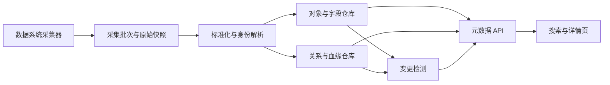

# 从一张订单表开始搭建元数据管理 MVP——字段、关系与治理全链路

## 1. 最终要做出什么

公司当前有三套系统：

- MySQL 业务库 `order_db`，保存原始订单表 `orders`。
- Flink 任务 `job_sync_orders`，读取 `orders`，清洗后写入 Paimon 表 `dwd_order_detail`。
- BI 报表“每日交易看板”，读取 `dwd_order_detail` 计算订单量和支付金额。

现在发生一个典型问题：开发人员准备把 `dwd_order_detail.buyer_id` 从字符串改成长整型，但没人知道有哪些任务、指标和报表会受影响；表的负责人是谁也不清楚；`buyer_mobile` 是否属于敏感数据只能靠口头确认。

元数据 MVP 完成后，用户打开 `dwd_order_detail` 的详情页，应当直接看到：

1. 它来自哪个数据系统，位于哪个技术命名空间。
2. 它有哪些字段，字段类型最近是否变化。
3. 谁负责这张表，谁负责业务口径。
4. 哪个任务生产它，它读取哪些上游表。
5. 哪些任务、指标、API 或报表依赖它。
6. 哪些字段是敏感字段，依据是什么。
7. 最近一次采集是否成功，这份元数据是否仍然可信。

这七个问题决定了 MVP 的对象模型。任何字段如果不能帮助回答这些问题，就不应该优先进入第一版。

## 2. 一条元数据是怎样产生的

元数据平台不会凭空知道 `dwd_order_detail`。它先连接数据系统，取得原始结构，再把不同系统的结构翻译成统一对象。

一次采集的输入可能是：

| 来源 | 原始信息 |
|---|---|
| MySQL | 数据库 `order_db`、表 `orders`、字段和主键信息 |
| Paimon Catalog | 数据库 `dwd`、表 `dwd_order_detail`、Schema、分区和表属性 |
| Flink 平台 | 任务 `job_sync_orders`、任务代码、输入表、输出表、运行状态 |
| BI 平台 | 报表名称、使用的数据集或 SQL 中引用的表和字段 |

采集器不能把这些原始 JSON 直接当成平台模型。MySQL 的 Database、Paimon 的 Catalog、Flink 的 Job、BI 的 Dataset 属于不同类型，字段名称也不统一。平台需要先建立自己的语言。

### 第一个对象：元数据来源

平台先登记四个 `MetadataSource`：

| source_id | source_type | name | endpoint_ref | owner | status |
|---|---|---|---|---|---|
| `src_mysql_order` | `MYSQL` | 订单业务库 | `conn-001` | 订单研发组 | `ACTIVE` |
| `src_paimon_lake` | `PAIMON` | 实时湖仓 | `conn-002` | 数据平台组 | `ACTIVE` |
| `src_flink_prod` | `FLINK_PLATFORM` | 实时计算平台 | `conn-003` | 实时研发组 | `ACTIVE` |
| `src_bi_prod` | `BI_PLATFORM` | 分析平台 | `conn-004` | 数据产品组 | `ACTIVE` |

这里的 `source_id` 是元数据平台自己的稳定 ID。`endpoint_ref` 只是指向凭证中心或连接配置的引用，不能把密码、Token、JDBC 密码直接存进元数据对象。

`source_type` 决定使用哪个采集器，也决定原始对象如何标准化。`status=ACTIVE` 表示平台仍应周期采集这个来源；它不代表来源中的每张表都有效。

`owner` 在这里是“数据源接入责任人”，负责连接可用和采集异常。以后表和指标还会有各自的 Owner。一个平台如果只有统一的 `owner_name` 字符串，很快就会分不清谁负责连接、谁负责表、谁负责业务口径。

### 第二个对象：采集批次

每次采集都创建一个 `CollectionRun`：

| run_id | source_id | started_at | finished_at | status | objects_seen | error_message |
|---|---|---|---|---|---|---|
| `scan-20261008-001` | `src_paimon_lake` | 10:00 | 10:03 | `SUCCESS` | 1287 | 空 |

`CollectionRun` 不是数据任务运行实例，而是元数据采集器的一次运行。它解决两个问题：这批元数据是什么时候看见的，以及采集失败时哪些对象可能已经过期。

如果不记录采集批次，当一张表突然没有出现在采集结果中，平台无法判断它是真的被删除，还是采集器中途失败。MVP 必须把“来源对象不存在”和“本次没有成功采到”区分开。

Dataphin 文档中的每日快照分区和各模块通信表，本质上也在解决批次一致性：只有模块完成后，整批结果才对外可见。自建 MVP 不需要照搬通信表，但需要 `CollectionRun.status` 和批次提交边界。

## 3. 建立对象身份：为什么不能只存表名

采集器看见了 `dwd_order_detail`，平台需要判断它是不是已经存在的对象。

最容易犯的错误是拿 `table_name` 当唯一键。但公司里可以同时存在：

- MySQL 的 `order_db.dwd_order_detail`。
- Paimon 的 `prod_catalog.dwd.dwd_order_detail`。
- 开发环境和生产环境各一张同名表。
- 表删除后重新创建，名称相同但已经是新的物理对象。

因此，MVP 的核心对象 `MetadataObject` 需要下面这些字段：

| 字段 | 示例值 | 解决的问题 |
|---|---|---|
| `object_id` | `obj-8f31` | 平台内部稳定身份，其他模块只引用它 |
| `object_type` | `TABLE` | 说明这是表，不是字段、任务或指标 |
| `source_id` | `src_paimon_lake` | 说明来自哪个系统 |
| `source_object_id` | `paimon-table-9821` | 保留来源系统原始 ID |
| `qualified_name` | `prod_catalog.dwd.dwd_order_detail` | 在来源系统内完整定位对象 |
| `name` | `dwd_order_detail` | 技术名称，用于展示和搜索 |
| `display_name` | `订单明细事实表` | 面向业务用户的名称 |
| `description` | `一行表示一个订单明细` | 说明业务含义和粒度 |
| `environment` | `PROD` | 区分开发与生产对象 |
| `lifecycle_state` | `ACTIVE` | 说明对象当前是否仍存在 |
| `source_created_at` | `2026-01-12 09:30` | 来源系统中的创建时间 |
| `source_modified_at` | `2026-10-07 18:20` | 来源系统中的最近修改时间 |
| `first_seen_at` | `2026-02-01 10:03` | 平台第一次采集到它的时间 |
| `last_seen_at` | `2026-10-08 10:03` | 最近一次确认它仍存在的时间 |
| `last_collection_run_id` | `scan-20261008-001` | 这份当前态由哪次采集确认 |

### `id`、`name`、`code` 和 `guid` 的区别

Dataphin 文档里大量出现 `*_id`、`*_name`、`*_name_cn`、`*_code`、`guid`。它们不是重复字段。

`object_id` 是元数据平台自己的稳定身份。即使技术名称从 `dwd_order_detail` 改成 `dwd_trade_order_detail`，下游责任、标签和历史仍然挂在同一个 `object_id` 上。

`source_object_id` 是来源系统分配的标识。如果来源系统能保证改名后 ID 不变，它是身份匹配的重要证据。如果来源系统只有名称，没有稳定 ID，平台只能组合 `source_id + qualified_name` 建立临时身份，并承认改名识别会不可靠。

`name` 是技术名称，可以变化。`display_name` 或 `name_cn` 是用户看到的业务名称，更容易变化。`code` 通常是组织人为定义的业务编码。`guid` 只是某个产品表达“全局 ID”的方式，不应直接假设它真的跨系统稳定。

如果 MVP 把名称当主键，表改名后会产生两个对象：旧对象保留血缘和 Owner，新对象只有最新字段，用户看到两份相互矛盾的资产。这就是稳定身份字段存在的实际原因。

### 技术位置不是业务归属

`qualified_name` 表示技术系统中的定位路径。为了让路径可解析，平台还要保存命名空间对象：

| object_id | object_type | name | parent_object_id |
|---|---|---|---|
| `ns-catalog-prod` | `CATALOG` | `prod_catalog` | `src_paimon_lake` |
| `ns-db-dwd` | `DATABASE` | `dwd` | `ns-catalog-prod` |
| `obj-8f31` | `TABLE` | `dwd_order_detail` | `ns-db-dwd` |

这里的 `parent_object_id` 只表达技术包含关系：Catalog 包含 Database，Database 包含 Table。它不能用来表示“订单表属于交易板块”。业务板块和数据域属于业务语义树，后面会通过另一类关系连接。

Dataphin 中的 `biz_unit_id`、`data_domain_id`、`project_id`、`db_name`、`schema_name`、`directory_id` 看起来都像“目录字段”，实际属于四种空间：

- `biz_unit`、`data_domain`：业务责任与语义空间。
- `project`：研发协作和资源空间。
- `catalog/database/schema`：技术命名空间。
- `directory/topic`：资产门户的展示空间。

MVP 如果把它们合并成一棵树，将来移动资产目录时就可能改变技术路径，或者数据库迁移时丢失业务归属。

## 4. 给对象挂上字段：Schema 不是一串 JSON

表对象建立后，采集器继续写入字段对象。`dwd_order_detail` 当前有五个字段：

| field_id | name | data_type | ordinal | nullable | primary_key | partition_key | description |
|---|---|---|---:|---|---|---|---|
| `fld-01` | `order_id` | `STRING` | 1 | 否 | 是 | 否 | 订单唯一标识 |
| `fld-02` | `buyer_id` | `STRING` | 2 | 否 | 否 | 否 | 买家标识 |
| `fld-03` | `buyer_mobile` | `STRING` | 3 | 是 | 否 | 否 | 下单手机号 |
| `fld-04` | `pay_amount` | `DECIMAL(18,2)` | 4 | 是 | 否 | 否 | 实付金额 |
| `fld-05` | `ds` | `STRING` | 5 | 否 | 否 | 是 | 业务日期分区 |

### 为什么字段也必须是对象

如果字段只作为表对象里的 JSON 数组保存，平台能展示 Schema，却难以完成字段级血缘、字段权限、敏感识别、字段质量和影响分析。

`buyer_mobile` 需要同时被以下关系引用：

- 被安全分类“个人联系方式”标记。
- 被安全等级“L3 机密”约束。
- 被脱敏策略“手机号掩码”应用。
- 从上游 `orders.mobile` 派生。
- 被下游报表隐藏或聚合。

因此字段需要稳定 `field_id`，而不是只有字段名。

### `is_pk` 为什么会造成误解

Dataphin 原文中的某个物理字段表使用了 `is_pk`，注释却写成“是否分区字段”。这暴露了含混命名的危害。MVP 应明确拆成：

- `is_primary_key`：是否属于主键。
- `is_partition_key`：是否用于物理分区。
- `is_unique`：值是否应唯一。
- `is_nullable`：是否允许空值。

这四个概念互不等价。订单表可以按 `ds` 分区，但 `ds` 不是主键；`order_id` 可以唯一，但在某些存储系统中并未声明物理主键。

### 字段变化不能直接覆盖

第二天开发人员把 `buyer_id` 从 `STRING` 改成 `BIGINT`。平台不能只覆盖 `data_type`，否则无法回答“什么时候变的、谁受影响”。

MVP 至少需要生成一个 `ChangeEvent`：

| change_id | object_id | change_type | before | after | detected_at | collection_run_id |
|---|---|---|---|---|---|---|
| `chg-1001` | `fld-02` | `FIELD_TYPE_CHANGED` | `STRING` | `BIGINT` | 2026-10-09 10:04 | `scan-20261009-001` |

`ChangeEvent` 保存变化事实；字段对象保存当前态。二者分开后，详情页显示当前类型，变更页展示历史，影响分析使用变化对象的 `field_id` 向下游遍历。

第一版不一定需要完整的时态数据库，但必须保留结构差异事件。否则“元数据管理”只能展示当前目录，不能承担变更治理。

## 5. 任务定义、运行实例和引擎作业必须拆开

采集 Flink 平台后，MVP 建立任务定义：

| 字段 | 示例值 | 含义 |
|---|---|---|
| `job_id` | `job-2001` | 平台内部任务身份 |
| `source_job_id` | `flink-job-template-91` | Flink 平台中的定义 ID |
| `name` | `job_sync_orders` | 任务名称 |
| `job_type` | `FLINK_SQL` | 实现类型 |
| `environment` | `PROD` | 所属环境 |
| `schedule_mode` | `CONTINUOUS` | 持续运行而非周期调度 |
| `definition_version` | `v17` | 当前代码或配置版本 |
| `owner_id` | `team-realtime` | 长期负责团队 |
| `lifecycle_state` | `ACTIVE` | 定义是否仍启用 |

这里没有把“当前运行是否正常”放进任务定义。因为任务定义和运行实例是两个对象。

一次部署或启动产生一个 `JobRun`：

| run_id | job_id | trigger_type | started_at | finished_at | run_status | submitted_by |
|---|---|---|---|---|---|---|
| `run-8001` | `job-2001` | `DEPLOY` | 09:00 | 空 | `RUNNING` | 张三 |

如果是离线任务，每天、重跑、补数会产生不同实例。`schedule_type`、`dagrun_type`、`taskrun_status` 等 Dataphin 字段就是在区分这些情况。

### 为什么不能只在任务上放一个 `status`

假设昨天运行失败，今天运行成功，而任务定义当前被暂停。这里同时存在三个事实：

- 昨天实例状态是 `FAILED`。
- 今天实例状态是 `SUCCESS`。
- 任务定义状态是 `PAUSED`。

一个 `status` 字段无法表达三者。成熟模型会分别保存定义生命周期、实例运行结果和调度启用状态。

### `owner`、`creator`、`modifier`、`submitter` 不是同一个人

任务由李四创建，王五最后修改，张三本次发布，实时研发组长期负责。对应字段分别是：

- `creator`：创建动作的执行人，用于审计。
- `modifier`：最近一次修改动作的执行人。
- `submitter`：本次提交或运行触发人。
- `owner`：长期承担责任的人或团队。

将它们都叫“负责人”会导致事故时找错人。MVP 可以先只实现 Owner 和动作审计人，但语义必须分开。

## 6. 把生产关系建出来：依赖不等于血缘

现在平台已经知道上游表、任务和下游表，但还没有说明它们怎样连接。

MVP 使用统一的 `ObjectRelation`：

| relation_id | relation_type | from_object_id | to_object_id | produced_by | source | confidence |
|---|---|---|---|---|---|---|
| `rel-01` | `READS_FROM` | `job-2001` | `obj-orders` | 空 | `SQL_PARSE` | `HIGH` |
| `rel-02` | `WRITES_TO` | `job-2001` | `obj-8f31` | 空 | `SQL_PARSE` | `HIGH` |
| `rel-03` | `DERIVES_FROM` | `obj-8f31` | `obj-orders` | `job-2001` | `SQL_PARSE` | `HIGH` |
| `rel-04` | `DERIVES_FROM` | `fld-02` | `fld-src-buyer` | `job-2001` | `SQL_PARSE` | `HIGH` |

### 方向必须固定

本文约定 `from_object_id` 是结果或使用方，`to_object_id` 是来源或被使用方：`dwd_order_detail DERIVES_FROM orders`。也可以反向设计，但全平台必须统一，否则影响分析会出现方向混乱。

### 为什么保存 `produced_by`

只记录 `dwd_order_detail` 来自 `orders`，可以画表级血缘，却无法解释通过哪个任务、哪个版本产生。`produced_by=job-2001` 把数据关系和生产过程连接起来。

### 为什么保存 `source` 和 `confidence`

血缘可能来自 SQL 静态解析、运行日志、用户手工登记或字段名推断。它们可信度不同：

- `SQL_PARSE`：解析任务代码得到，通常较可靠，但动态 SQL 可能缺失。
- `RUNTIME_OBSERVATION`：运行时观察到真实读写，能证明发生过，但未必能得到字段映射。
- `MANUAL`：人工登记，可以补充语义，但需要责任人维护。
- `INFERRED`：基于名称或规则推断，只能作为候选关系。

如果不记录来源，错误血缘出现后无法判断应该修解析器、修运行采集还是找人工维护者。

### 调度依赖是另一种关系

离线任务 `job_build_order_summary` 必须等 `job_sync_orders` 完成，可以建立：

`job_build_order_summary DEPENDS_ON job_sync_orders`

这只说明执行顺序。前者可能并不读取后者产出的表，也可能通过别的表间接读取。因此 `DEPENDS_ON` 不能直接转成 `DERIVES_FROM`。

Dataphin 同时存在节点依赖表和数据血缘表，正是因为二者解决的问题不同。

### 字段级血缘如何自然产生

SQL 解析器发现：

- `dwd_order_detail.order_id` 来自 `orders.id`。
- `dwd_order_detail.buyer_id` 来自 `orders.user_id`。
- `dwd_order_detail.pay_amount` 来自 `orders.item_amount - orders.discount_amount`。

前两条是一对一映射，第三条是多输入表达式。第一版 `ObjectRelation` 可以为每个输入字段创建一条 `DERIVES_FROM`，并在扩展属性中保存表达式摘要。不要把多个输入字段 ID 拼成逗号字符串，否则无法单独追踪某个字段的影响范围。

## 7. 技术对象怎样获得业务含义

到目前为止，平台只知道“有一张表、一些字段、一个生产任务”。业务用户仍然不知道这张表表示什么。

### 业务板块、数据域和业务过程

平台建立三个语义对象：

| 语义对象 | 示例 | 回答的问题 |
|---|---|---|
| 业务板块 | 交易 | 哪个业务责任范围负责这批数据 |
| 数据域 | 订单 | 数据围绕哪个稳定业务主题组织 |
| 业务过程 | 下单 | 事实记录的是哪个可重复发生的业务事件 |

它们不是技术目录。`dwd_order_detail` 物理上移动到另一个数据库，仍然可以属于“订单”数据域；资产目录从“经营分析”移到“核心资产”，也不改变它记录“下单”业务过程。

### 逻辑模型连接业务与物理实现

平台建立逻辑模型 `lm_order_detail`：

| 字段 | 值 |
|---|---|
| `model_type` | `FACT` |
| `grain` | 每个订单一行 |
| `business_process` | 下单 |
| `business_time_field` | `order_time` |
| `owner` | 交易数据组 |

再建立关系：

`dwd_order_detail IMPLEMENTS lm_order_detail`

`IMPLEMENTS` 说明物理表是逻辑模型的技术实现。以后表迁移或拆分时，逻辑模型仍然稳定；一个逻辑模型也可以映射开发、生产两套物理表。

Dataphin 中的 `dim_dataphin_model` 与 `dim_dataphin_table` 分开，就是在区分这两层。`is_from_logical` 只能告诉你“是不是由逻辑建模产生”，显式 `IMPLEMENTS` 关系才能告诉你“由哪个模型产生”。

### 字段、属性、度量和指标

`buyer_id` 是物理字段。把它放进逻辑模型后，它成为“买家”维度引用；`pay_amount` 是物理字段，在业务语义中被定义为可加度量。

原子指标“支付金额”定义为对 `pay_amount` 求和；业务限定“支付成功”定义过滤条件；统计周期“日”和粒度“买家”共同组成派生指标“买家日支付金额”。

这条链路是：

物理字段 → 逻辑度量 → 原子指标 → 业务限定 + 周期 + 粒度 → 派生指标

如果直接把 `pay_amount` 称为“支付金额指标”，会丢掉统计方式、过滤条件、时间窗口和分析粒度。Dataphin 原文中原子指标、业务限定、统计周期和派生指标分别建模，就是为了避免口径只剩一个字段名。

### 业务术语如何进入 MVP

第一版不必完整实现指标平台，但至少需要 `BusinessTerm` 和绑定关系：

| term_id | term_type | name | definition | owner |
|---|---|---|---|---|
| `term-order-id` | `BUSINESS_TERM` | 订单编号 | 业务系统生成的订单唯一标识 | 订单产品组 |
| `term-pay-amount` | `MEASURE` | 实付金额 | 用户实际支付金额，不含退款 | 财务数据组 |

再建立：

- `fld-01 DESCRIBED_BY term-order-id`
- `fld-04 DESCRIBED_BY term-pay-amount`

这样字段技术类型变化时，业务定义仍然存在；业务定义修改时，也能找到所有实现字段。

## 8. 责任不是一个 `owner_name`

成熟平台里，同一对象可能有多种责任：

| 对象 | 角色 | 主体 | 责任 |
|---|---|---|---|
| `dwd_order_detail` | `TECHNICAL_OWNER` | 数据研发组 | 表结构、任务和可用性 |
| `dwd_order_detail` | `BUSINESS_OWNER` | 订单产品组 | 业务含义和使用边界 |
| `buyer_mobile` | `SECURITY_STEWARD` | 数据安全组 | 分类分级与脱敏策略 |
| 唯一性规则 | `QUALITY_OWNER` | 数据质量组 | 规则阈值和问题跟踪 |

MVP 使用 `OwnershipAssignment`：

| assignment_id | object_id | role | principal_type | principal_id | valid_from | valid_to | source |
|---|---|---|---|---|---|---|---|
| `own-01` | `obj-8f31` | `TECHNICAL_OWNER` | `TEAM` | `team-data-dev` | 2026-01-01 | 空 | `MANUAL` |

`principal_type` 允许责任主体是用户或团队。`valid_from`、`valid_to` 让负责人变更可追溯。`source` 说明它是人工确认、组织同步还是规则推断。

Dataphin 中 `owner`、`creator`、`modifier`、`submitter`、`quality_owner`、`on_shelve_user` 分散在不同表中。抽象后要区分两类信息：

- 责任关系：谁长期对对象负责。
- 动作审计：谁创建、修改、提交、发布了某次变更。

这两类信息不能互相替代。

## 9. 安全治理：分类、分级、权限和脱敏如何串起来

平台扫描 `buyer_mobile`，识别它可能是手机号。这里至少有四个对象或关系：

1. 分类“个人信息/联系方式”。
2. 等级“L3 机密”。
3. 识别规则“手机号格式识别”。
4. 识别结果“字段 `buyer_mobile` 命中该规则，置信度 0.98”。

识别规则是定义，识别结果是一次判断。不能直接在字段上写 `security_level=L3` 后丢掉依据，否则无法解释这是人工指定、自动扫描还是从上游继承。

一个 `ClassificationAssignment` 可以保存：

| 字段 | 示例值 | 作用 |
|---|---|---|
| `object_id` | `fld-03` | 被分类的字段 |
| `classification_id` | `class-contact` | 分类 |
| `security_level_id` | `level-L3` | 等级 |
| `assignment_source` | `AUTO_SCAN` | 人工、扫描或血缘继承 |
| `rule_id` | `identify-phone` | 使用的识别规则 |
| `confidence` | `0.98` | 自动识别可信度 |
| `confirmed_by` | `user-security-01` | 人工确认人 |
| `effective_at` | 时间 | 生效时间 |

### 权限、可见范围、脱敏不是一回事

分析师在资产目录中能看见“订单明细”，只表示目录可见；申请并获得 `SELECT` 权限后，才可以访问数据；即使有访问权限，手机号仍可能被脱敏成 `138****5678`。

因此平台需要三个独立判断：

- `CatalogVisibility`：用户是否能发现资产。
- `PermissionGrant`：主体对资源拥有什么动作权限、有效期多长。
- `MaskingPolicyBinding`：读取敏感字段时应用什么脱敏策略、是否存在白名单。

把三者合并成“是否可见”会制造严重安全歧义。

MVP 不必真正承担数据库鉴权，但要能展示这三种关系，并为后续权限系统留下模型位置。

## 10. 数据质量：规则成功不代表数据合格

为 `order_id` 建立唯一性规则：

| 字段 | 值 |
|---|---|
| `rule_id` | `qr-order-id-unique` |
| `rule_type` | `UNIQUENESS` |
| `target_object_id` | `fld-01` |
| `severity` | `STRONG` |
| `threshold` | 重复率等于 0 |
| `enabled` | 是 |
| `owner` | 数据质量组 |

每天执行后生成 `QualityRuleRun`：

| run_id | rule_id | data_time | execution_status | validation_result | observed_value |
|---|---|---|---|---|---|
| `qrun-01` | `qr-order-id-unique` | 2026-10-07 | `SUCCESS` | `FAILED` | 重复率 0.03% |

`execution_status=SUCCESS` 表示检查程序成功完成；`validation_result=FAILED` 表示数据没有通过。Dataphin 中 `rule_task_status` 与 `is_validate_result` 分开，就是这个原因。

失败结果还不等于治理问题。系统可能先等待重试、合并同类失败或由负责人确认。确认后生成 `QualityIssue`：

| issue_id | related_run_id | status | assignee | root_cause | due_at |
|---|---|---|---|---|---|
| `issue-01` | `qrun-01` | `OPEN` | 订单研发组 | 待分析 | 2026-10-10 |

整改过程中再产生认领、修复、验证、关闭等操作记录。于是完整链路是：

质量规则 → 规则执行 → 观测指标 → 失败结果 → 质量问题 → 整改流程 → 复验关闭

如果平台只在表上放一个红色“质量差”标签，就无法知道是哪条规则、哪天失败、失败多少、谁负责以及是否已经修复。

MVP 可以先做到规则、执行结果和问题三层；复杂整改流程放到后续。

## 11. 从技术对象变成资产

`dwd_order_detail` 被采集到资源目录时，它只是一个技术对象。要进入面向用户的资产目录，还需要：

- 业务展示名称和说明。
- 业务板块、数据域和业务过程。
- 技术 Owner 和业务 Owner。
- 字段说明、敏感等级和质量状态。
- 使用说明、更新频率和服务承诺。
- 目录位置、专题和标签。
- 可见范围与权限申请入口。

MVP 建立 `AssetPublication`：

| 字段 | 示例值 | 含义 |
|---|---|---|
| `asset_id` | `asset-order-detail` | 资产身份 |
| `primary_object_id` | `obj-8f31` | 主要底层对象 |
| `asset_type` | `DATA_TABLE` | 面向消费的资产类型 |
| `publication_state` | `PUBLISHED` | 候选、已发布、已下架、已归档 |
| `catalog_node_id` | `catalog-trade-core` | 展示目录位置 |
| `visibility_policy_id` | `vis-company` | 谁能发现它 |
| `published_by` | `user-owner-01` | 发布操作人 |
| `published_at` | 时间 | 发布时间 |

### 为什么资产和对象要分开

底层表还存在，但负责人决定暂时不对外提供，可以下架资产而不删除技术对象。底层表被替换后，资产也可以改绑新对象并保留相同业务身份。

Dataphin 的全域对象表与已上架资产表分开，表达的正是“被发现”和“被发布”两个状态。自建平台如果直接把所有采集表都叫资产，就无法管理发布质量和下架流程。

### 收藏和浏览属于消费事实

`favorites_count`、`pv_count`、API 调用次数属于用户使用行为。它们可以帮助识别热门或僵尸资产，但不能证明数据质量好、口径正确或权限合规。

MVP 可以先记录最近访问时间和总访问次数，后续再增加用户行为明细。动态使用指标不要直接覆盖核心对象属性，应带上观测时间和来源。

## 12. 一次字段变更如何走完整条链路

现在回到最初的问题：开发人员准备把 `buyer_id` 从 `STRING` 改为 `BIGINT`。

### 采集前

平台当前保存：

- `fld-02` 当前类型是 `STRING`。
- `fld-02` 从上游 `orders.user_id` 派生。
- 下游字段 `ads_user_order.buyer_id` 从 `fld-02` 派生。
- 报表“每日交易看板”引用下游表。
- 技术 Owner 是数据研发组。

### 新一轮采集

采集器在 `scan-20261009-001` 中看到 `buyer_id=BIGINT`。身份解析确认字段仍是 `fld-02`，不是新字段，于是更新当前态并写入 `FIELD_TYPE_CHANGED` 事件。

### 影响分析

影响分析服务从 `fld-02` 沿 `DERIVES_FROM` 反向查找，得到：

1. 下游字段 `ads_user_order.buyer_id`。
2. 下游表 `ads_user_order`。
3. 生产任务 `job_build_user_order`。
4. 报表“每日交易看板”。

### 责任通知

系统查询这些对象的 `OwnershipAssignment`，找到数据研发组和报表 Owner。这里使用的是责任关系，不是字段创建人或最近修改人。

### 治理检查

系统发现 `buyer_id` 绑定了“买家标识”业务术语，没有敏感等级变化；字段级质量规则需要检查是否仍适用于数值类型。

### 最终呈现

变更页面展示旧值、新值、发现时间、来源批次、影响对象和责任人。用户不需要理解采集器内部细节，也能判断是否允许上线。

这条完整链路依赖的不是几十张孤立表，而是稳定对象、字段、关系、责任、变更事件和治理绑定六类核心模型。这也是 MVP 应优先实现的部分。

## 13. 元数据管理 MVP 的最小边界

第一版要解决的是“知道有什么、知道怎样产生、知道谁负责、知道发生了什么变化”。不要一开始复制 Dataphin 的全部安全、质量、指标、API 和整改能力。

### MVP 必须包含

1. 元数据来源与采集批次。
2. 统一元数据对象和技术命名空间。
3. 表与字段结构。
4. 任务定义与最近运行状态。
5. 表级、字段级血缘及关系来源。
6. 多角色责任关系。
7. 结构变更事件。
8. 对象搜索和详情页。

### MVP 可以延后

- 完整指标管理与派生指标计算。
- 真实数据库权限下发和回收。
- 脱敏策略执行引擎。
- 完整质量规则调度和整改工作流。
- 多级审批、资产评分和推荐。
- 图数据库、独立搜索引擎、消息队列。
- 多租户商业化隔离。

第一版可以展示敏感分类、质量状态和业务术语，但允许人工维护，不必立即实现自动扫描和执行引擎。

## 14. MVP 的最小对象模型

### 1. `metadata_source`

保存接入系统和采集配置引用。

必需字段：`source_id`、`source_type`、`name`、`connection_ref`、`owner_principal_id`、`status`、`last_successful_run_id`。

它回答“从哪里采”。凭证不直接存这里。

### 2. `collection_run`

保存一次元数据采集的开始、结束、状态、数量和错误。

必需字段：`run_id`、`source_id`、`started_at`、`finished_at`、`status`、`objects_seen`、`error_summary`。

它回答“这份元数据何时、是否完整地采到”。

### 3. `metadata_object`

保存所有对象的稳定身份和公共属性，包括命名空间、表、字段以外的任务、报表和业务术语也可以进入统一对象目录。

必需字段：`object_id`、`object_type`、`source_id`、`source_object_id`、`parent_object_id`、`qualified_name`、`name`、`display_name`、`description`、`environment`、`lifecycle_state`、`first_seen_at`、`last_seen_at`、`source_modified_at`、`last_collection_run_id`、`attributes`。

`attributes` 只存变化快且不参与核心关联的扩展属性。Owner、血缘和字段结构不能全部塞进这里。

### 4. `schema_field`

保存字段专属结构。虽然字段也有 `metadata_object` 记录，但专属属性单独放置。

必需字段：`field_id`、`parent_object_id`、`data_type`、`ordinal_position`、`nullable`、`primary_key`、`partition_key`、`default_value`。

这种“公共对象 + 类型扩展”结构比一张超级表稳定，也比每种对象完全独立更容易统一搜索和关系管理。

### 5. `job_definition`

保存任务定义专属属性。

必需字段：`job_id`、`job_type`、`definition_version`、`schedule_mode`、`schedule_expression`、`enabled`、`code_reference`。

任务本身也在 `metadata_object` 中拥有名称、来源、环境和生命周期。

### 6. `job_run`

保存任务运行事实。

必需字段：`run_id`、`job_id`、`trigger_type`、`business_time`、`started_at`、`finished_at`、`run_status`、`submitted_by`、`source_run_id`。

MVP 只需保留最近一段时间或最近若干次运行；它不是完整监控平台。

### 7. `object_relation`

保存对象之间的一等关系。

必需字段：`relation_id`、`relation_type`、`from_object_id`、`to_object_id`、`produced_by_object_id`、`source_method`、`confidence`、`first_seen_at`、`last_seen_at`、`lifecycle_state`、`attributes`。

第一版关系类型只需要 `CONTAINS`、`READS_FROM`、`WRITES_TO`、`DERIVES_FROM`、`DEPENDS_ON`、`DESCRIBED_BY`、`IMPLEMENTS`。

### 8. `ownership_assignment`

保存主体对对象承担的责任。

必需字段：`assignment_id`、`object_id`、`role_type`、`principal_type`、`principal_id`、`valid_from`、`valid_to`、`source_method`。

第一版角色只需要技术 Owner 和业务 Owner。

### 9. `change_event`

保存结构和关系变化。

必需字段：`change_id`、`object_id`、`change_type`、`before_value`、`after_value`、`detected_at`、`collection_run_id`、`acknowledged_by`、`acknowledged_at`。

第一版变化类型只需要对象新增、对象失联、字段新增、字段删除、字段类型变化、血缘变化。

### 可选的第十张表：`business_term`

如果 MVP 必须服务非技术用户，再增加业务术语和对象绑定。否则先把业务名称与说明保存在对象上，第二阶段再拆。

## 15. MVP 不需要图数据库

第一版可以使用一个关系型数据库保存全部核心数据。`object_relation` 的 `from_object_id` 和 `to_object_id` 建立索引后，足以支持几层上下游查询和影响分析。

图数据库在以下情况才有明显价值：关系达到千万级以上、经常执行深层路径算法、需要复杂图模式匹配、关系查询成为主要性能瓶颈。在这些条件出现之前，引入图数据库会增加双写、一致性、备份和运维成本。

搜索也可以先使用数据库的模糊匹配或全文索引。只有对象数量、排序相关性和聚合筛选复杂度超出数据库能力后，再引入独立搜索引擎。

因此一个可落地的 MVP 可以只有：

- 一个元数据服务。
- 一个 PostgreSQL 数据库。
- 一个周期任务执行器。
- 两到三个采集器。
- 一个简单 Web 前端。

## 16. MVP 的模块结构

### 采集器

负责调用来源系统接口或读取 Catalog，输出统一的原始对象、字段、任务和关系。采集器不直接决定资产目录、Owner 或治理规则。

### 标准化与身份解析

负责类型映射、路径规范化、稳定 ID 匹配和软删除判断。它是 MVP 中最需要测试的模块，因为身份错误会污染所有血缘和责任关系。

### 对象仓库

维护对象当前态和类型扩展。它是平台事实源，不是搜索宽表。

### 关系仓库

维护结构包含、任务读写、数据血缘和调度依赖。第一版就是关系表，不需要单独图服务。

### 变更检测

比较本次采集与上一版本，产生变更事件。对象当前态更新与变更事件写入必须属于同一批次提交。

### 元数据 API

提供对象搜索、详情、Schema、上下游、Owner、最近变更和采集状态。它对前端隐藏底层表结构。

## 17. MVP 最少需要四个页面

### 来源管理页

显示数据源类型、连接状态、Owner、最近成功采集时间、最近失败原因和对象数量。用户能手工触发采集并查看批次结果。

### 对象搜索页

支持按名称、类型、来源、环境和 Owner 筛选。第一版不必做复杂相关性算法，但搜索结果必须显示完整路径，避免同名对象无法区分。

### 对象详情页

至少包含：

- 概览：名称、完整路径、类型、来源、环境、状态、Owner。
- Schema：字段、类型、说明、主键、分区键。
- 血缘：直接上游、直接下游、生产任务、关系来源。
- 变更：字段新增、删除、类型变化、血缘变化。
- 采集信息：最近成功批次、最近确认时间。

敏感分类、质量和业务术语可以先作为人工标注区域。

### 任务详情页

显示任务定义、Owner、输入输出、调度依赖、最近运行实例和代码版本引用。不要把任务定义状态与最近一次运行状态合并展示。

## 18. MVP 的最小接口

这里描述接口职责，不限定具体协议或框架。

### 采集侧

- 创建采集批次。
- 批量上报对象与字段。
- 批量上报关系。
- 完成或失败采集批次。

只有批次完成后，本批数据才切换为可见当前态。采集器中途失败时，不能把未上报对象标记为删除。

### 查询侧

- 按条件搜索对象。
- 获取对象概览和类型扩展。
- 获取表的字段。
- 获取直接或限定深度的上下游。
- 获取任务最近运行实例。
- 获取对象变更历史。
- 获取采集来源和最近批次。

### 人工维护侧

- 设置或变更 Owner。
- 补充展示名称和业务说明。
- 绑定业务术语。
- 确认或驳回候选血缘。
- 确认变更事件已评估。

人工维护字段必须和自动采集字段分层。再次采集时，不能用来源系统的空描述覆盖人工补充的业务说明。

## 19. 一次采集的内部处理顺序

1. 创建 `CollectionRun`，状态为 `RUNNING`。
2. 采集器读取来源元数据，保存本批原始快照或至少保存摘要和校验信息。
3. 标准化对象类型、数据类型和命名空间。
4. 使用来源 ID 或完整路径进行身份匹配。
5. 写入或更新对象当前态，记录 `last_seen_at`。
6. 写入字段并计算 Schema 差异。
7. 写入任务和关系，计算血缘差异。
8. 生成 `ChangeEvent`。
9. 批次成功后，处理本次未出现的历史对象。
10. 将 `CollectionRun` 标记为 `SUCCESS`，原子切换当前可见版本。

第 9 步不能简单地“没看到就删除”。更安全的策略是：只有采集批次成功，且对象连续若干次未出现，才把它标记为 `MISSING`；经过确认或达到阈值后再标记 `DELETED`。这样可以避免权限波动或临时接口缺失造成大规模误删。

## 20. MVP 的验收场景

### 场景一：同名表不会混淆

两个来源都存在 `orders`。搜索结果显示各自完整路径和来源；对象 ID 不同；血缘不会串线。

### 场景二：表改名不会丢失历史

来源系统提供稳定 ID 时，`orders` 改名为 `order_header` 后仍是同一个对象，Owner、说明和血缘保留，并产生改名事件。

### 场景三：采集失败不会误删对象

采集器运行到一半失败。批次状态为 `FAILED`，未出现的对象不改变生命周期。

### 场景四：字段类型变化产生影响范围

`buyer_id` 从 `STRING` 改为 `BIGINT`。系统生成变更事件，并沿字段级血缘找到直接和间接下游。

### 场景五：任务定义和运行状态分开

任务定义处于启用状态，最近一次运行失败。详情页同时显示“任务已启用”和“最近运行失败”，不能只展示一个状态。

### 场景六：血缘来源可追溯

同一条血缘同时由 SQL 解析和运行日志发现。系统能够展示两个证据来源；手工关系不会被自动采集静默覆盖。

### 场景七：人工说明不会被采集覆盖

业务 Owner 为表补充业务粒度说明。下一次来源系统返回空注释，人工说明仍然保留。

### 场景八：对象下架不等于物理删除

资产从目录下架后，技术对象、历史血缘和变更记录仍然存在；重新上架时可以继续使用原资产身份。

这八个场景全部通过，MVP 才真正具备元数据管理能力，而不是只有一张表目录页面。

## 21. 从 MVP 扩展到完整平台

### 第二阶段：业务语义

增加业务板块、数据域、业务过程、逻辑模型、维度、度量、业务术语和指标。建立逻辑对象与物理实现的显式关系。

### 第三阶段：治理控制

增加分类分级、识别规则、脱敏策略、权限记录、质量规则、质量执行和数据标准。规则定义、绑定、执行、结果必须分开。

### 第四阶段：资产运营

增加资产发布、目录专题、可见范围、申请流程、收藏、浏览、评价、API 和消费应用。

### 第五阶段：自动化

利用变更事件和血缘触发影响通知、Owner 确认、规则继承、敏感等级传播、过期权限回收和僵尸资产治理。

这些能力都建立在 MVP 的稳定对象、关系、责任和变更模型上。底座不稳定时，越早堆叠治理功能，后续返工越大。

## 22. Dataphin 大量字段在完整平台中的位置

到这里再看原文中的字段，不再是一组孤立名词。

`tenant_id`、用户、用户组和项目成员属于组织与身份。它们决定隔离和参与者。

`data_source_id`、`db_name`、`schema_name`、`table_name`、`column_name`、`storage_format` 属于技术资源注册。它们说明对象在哪里、结构怎样。

`biz_unit_id`、`data_domain_id`、`biz_process_id`、`dimension_id`、`atom_index_id`、`adjunct_word_id`、`granularity_id` 属于业务语义。它们说明数据代表什么、按什么口径计算。

`node_id`、`taskrun_id`、`schedule_type`、`dagrun_type`、开始结束时间、运行状态属于生产运行。它们说明数据如何产生以及某次是否成功。

`input_*`、`output_*`、`parent_*`、`ref_*`、`related_*` 属于关系模型。前缀不是为了命名好看，而是在表达关系两端和关系类型。

`classify`、`security_level`、`identify_rule`、`desensitize_rule` 属于安全治理。规则、结果和策略绑定应分开。

`watch_id`、`rule_id`、`rule_task_id`、`execute_context`、`is_validate_result` 属于质量治理。从监控对象到规则、执行和结果形成完整链路。

`directory_id`、`topic_id`、`tags_list`、`view_scope`、`favorites_count`、`pv_count` 属于资产消费。它们不应该污染技术对象的身份和结构。

`gmt_create`、`gmt_modified`、`biz_date`、`last_seen_at`、`version`、`ds` 属于时间与版本。它们分别表示来源时间、业务时间、采集时间、版本和快照，不能混用。

`config`、`properties`、`context`、`detail` 属于扩展配置或运行上下文。需要筛选、关联和约束的内容应结构化，只有类型差异大且变化快的内容才保留 JSON。

## 23. 这套模型中最重要的设计决定

### 对象和关系分开

对象只描述自己；血缘、依赖、责任、语义绑定、治理绑定都作为关系存在。这样关系可以独立记录来源、状态和历史。

### 定义和事实分开

任务定义与运行实例分开，质量规则与规则执行分开，资产定义与访问行为分开。定义描述“应该怎样”，事实描述“实际发生了什么”。

### 当前态和变化历史分开

对象表服务详情页和搜索；变化事件服务审计与影响分析。不能为了保留历史让所有查询都扫描全量快照，也不能只保留当前值。

### 自动采集和人工维护分开

技术名称、类型和 Schema 由采集器维护；业务名称、说明、Owner 和术语绑定允许人工确认。每个字段应知道自己的来源和覆盖优先级。

### 核心模型和搜索投影分开

对象、关系和事实是事实源；资产详情宽表、搜索文档和统计汇总都是可重建投影。不要因为页面方便，就把所有领域字段永久堆到一张超级资产表。

## 24. 原文中的边界和勘误

原文页面以 MaxCompute 共享模型为载体，但本文抽出的对象、关系、责任、状态和治理模型与计算引擎无关。特定作业表、endpoint、存储生命周期等应留在连接器扩展中。

原文字段 `is_pk` 与“是否分区字段”的注释冲突。自建模型必须拆成主键和分区键两个字段。

原文存在 `shema_name` 拼写。统一模型使用规范的 `schema`，来源映射仍保留原字段名，避免采集时找不到字段。

一些 `table_id`、`column_id` 在产品升级后被废弃，说明平台身份不能永久绑定某个来源产品的历史 ID。

页面中的节点参与表级血缘 DDL疑似重复了字段级血缘内容。领域模型仍应明确区分表到表、任务参与的表到表、任务参与的字段到字段三种粒度。

旧版负责人字段的取值逻辑发生过变化。自建平台应使用独立责任关系，并记录角色、来源和有效期。

## 25. 学完后应能回答的问题

如果已经理解本文，应当能够直接回答：

1. 为什么表名不能作为元数据对象唯一身份？
2. 为什么技术命名空间、数据域和资产目录必须分开？
3. 为什么字段需要独立 ID，而不能只存在 Schema JSON 中？
4. 任务定义、运行实例和引擎作业分别记录什么？
5. 调度依赖与数据血缘为什么不能互相替代？
6. 为什么 Owner 与创建人、修改人、提交人必须分开？
7. 为什么规则执行成功不等于数据质量通过？
8. 为什么被采集到的平台对象还不一定是资产？
9. 为什么 MVP 先用关系表就够了，不必立刻引入图数据库？
10. 一次字段类型变化如何通过对象、关系、责任和变更事件形成影响分析？

这些问题能够连贯回答，说明看到 Dataphin 或其他元数据平台的大量专业字段时，已经不再需要逐列死记：可以判断字段属于哪个阶段、解决什么问题、应该挂在哪个对象或关系上，以及它是否值得进入自己的 MVP。

## 原文覆盖说明

本文已经把原文中的组织用户、项目、数据源、物理表字段、逻辑建模、任务运行、血缘、权限、安全、质量、标准、实时任务、资产目录、数据服务、数据集和批次完成机制纳入同一条建设链路。

原文的逐表 DDL 和查询 SQL 没有搬入本文；专业字段只在它影响对象身份、关系、生命周期、责任、治理或 MVP 实现时展开。本文可独立阅读，不依赖读者返回原文补齐上下文。
