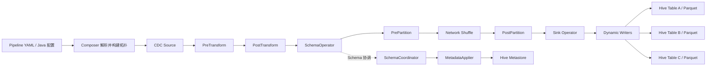
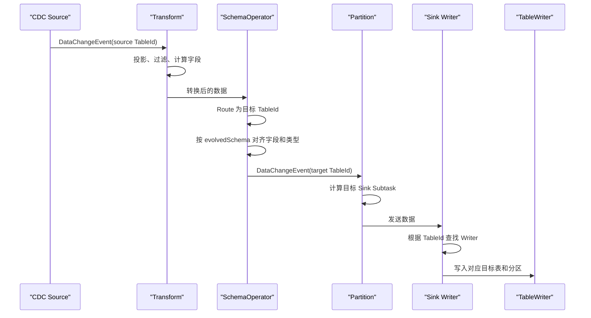
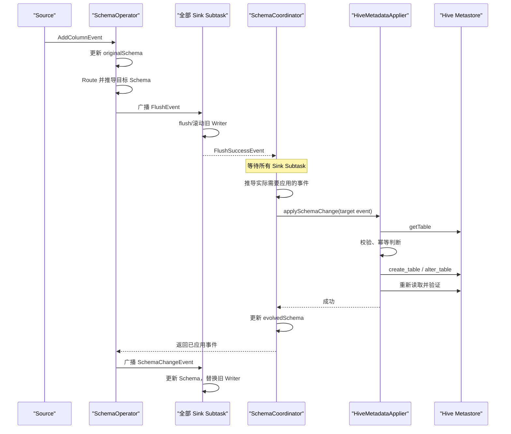
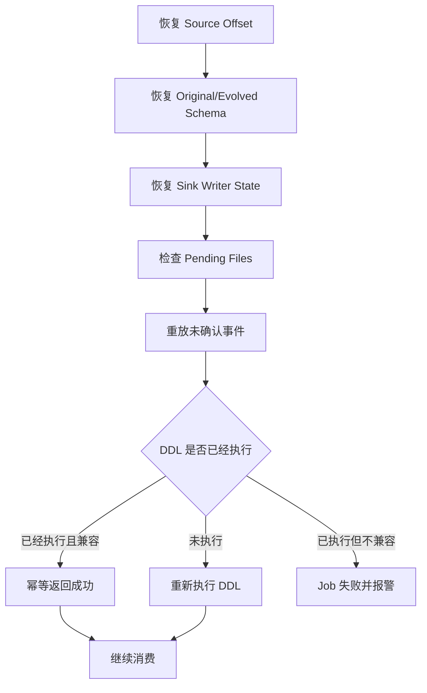
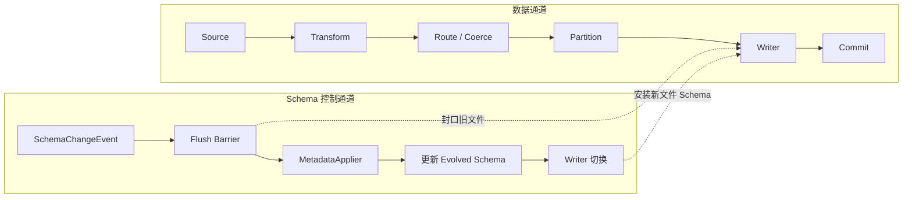

# Flink CDC Pipeline 动态多表 Hive Parquet Sink

> 适用范围：自研或扩展 Flink CDC Pipeline Sink，将多张逻辑表动态写入 Hive + Parquet。当前 Flink CDC 官方 Pipeline Connector 并不提供通用 Hive Sink，因此本文描述的是实现模型，不代表复制 YAML 即可直接获得该能力。

## 1. 核心结论

Composer 负责把 Source、Schema Operator、Route 和 Sink 组装成一个 Flink Job；它不直接写 Hive，也不执行 Parquet 序列化。多表同步时，一个逻辑 Sink 可以在内部维护多个表级写入上下文，也可以由 Composer 按表生成多个 Sink Operator。无论外部看起来是一个还是多个 Sink，每张 Hive 表最终都必须拥有独立的目标路径、Schema、分区 Writer 和提交状态。

```text
一个 Flink JobID
  → Source：产生 DataChangeEvent / SchemaChangeEvent
  → Route：源 TableId 映射为目标 TableId
  → Schema Operator：协调 Schema 变化
  → HiveParquetSink
      ├── Writer<table_a, partition_a, schema_v1>
      ├── Writer<table_a, partition_b, schema_v1>
      └── Writer<table_b, partition_a, schema_v3>
```

“一个 Sink 写多张表”不等于所有数据共用同一个 Parquet Writer。更准确的抽象是：一个 Sink Operator 内部根据 `TableId + PartitionSpec + SchemaVersion` 查找或创建 Writer。

## 2. 两条相互配合的处理链路

### 2.1 元数据链路

```text
SchemaChangeEvent
  → Flink CDC Schema
  → Hive 类型和字段结构映射
  → Hive Table 元数据
  → Hive Metastore：CREATE TABLE / ALTER TABLE
```

这里转换的是表结构，而不是业务数据。实现可以拼接并执行 Hive DDL，也可以调用 Hive Metastore API 创建或修改 `Table` 对象。后者通常包含：库名、表名、普通字段、分区字段、存储路径、Parquet InputFormat/OutputFormat 和 SerDe。

### 2.2 数据链路

```text
DataChangeEvent
  → 读取目标 TableId
  → 提取 Hive 分区值
  → 获取当前 SchemaVersion
  → 查找或创建 Parquet Writer
  → CDC Row 转换为 Parquet Record
  → 写入临时文件
  → Checkpoint 成功后提交正式文件
```

Hive Metastore 只保存表定义和文件位置；真实数据仍在 Parquet 文件中。查询时 Hive/Spark 把 Metastore Schema 与文件数据结合起来。

## 3. CDC Schema 转换为 Hive Table

目标 `TableId` 应优先来自 Route 的结果，不能盲目把 Source 的 namespace/schema 当作 Hive Database。不同 Source 对 TableId 层级的解释不同，应通过明确的映射规则得到目标库表。

字段转换的核心规则如下：

```text
目标 TableId.schema/table      → Hive Database/Table
CDC 普通字段                   → StorageDescriptor.cols
CDC 分区字段                   → Table.partitionKeys
CDC DataType                   → Hive Type
字段注释                       → FieldSchema.comment
Sink 配置                      → Location、表类型、文件格式、SerDe
```

普通字段和分区字段必须分开，分区字段不能同时放入 `StorageDescriptor.cols` 和 `Table.partitionKeys`。分区字段通常来自 Pipeline Transform、Sink 配置或数仓规范，不能仅凭字段名随意推断。

```java
HiveTable buildHiveTable(TableId tableId, TableSchema schema, HiveSinkOptions options) {
    Set<String> partitionKeys = new LinkedHashSet<>(schema.getPartitionKeys());
    List<HiveField> normalFields = new ArrayList<>();
    List<HiveField> partitionFields = new ArrayList<>();

    for (ColumnDefinition column : schema.getColumns()) {
        HiveField field = new HiveField(
                column.getName(),
                convertToHiveType(column.getType()),
                column.getComment());

        if (partitionKeys.contains(column.getName())) {
            partitionFields.add(field);
        } else {
            normalFields.add(field);
        }
    }

    return HiveTable.builder()
            .database(tableId.getDatabase())
            .tableName(tableId.getTableName())
            .columns(normalFields)
            .partitionColumns(partitionFields)
            .location(options.resolveLocation(tableId))
            .external(true)
            .fileFormat("PARQUET")
            .build();
}
```

类型映射必须显式处理，例如 `VARCHAR/CHAR → STRING`、`INTEGER → INT`、`BIGINT → BIGINT`、`DECIMAL(p,s) → DECIMAL(p,s)`、`TIMESTAMP → TIMESTAMP`。复杂类型、时区类型、Decimal 精度和不兼容变更必须单独验证。

## 4. Hive 建表和修改表

元数据操作必须幂等，因为任务失败恢复后，同一个 SchemaChangeEvent 可能再次处理。

```java
void applySchema(TableId tableId, TableSchema oldSchema, TableSchema newSchema) {
    if (!metastore.tableExists(tableId)) {
        HiveTable table = buildHiveTable(tableId, newSchema, options);
        metastore.createTableIfNotExists(table);
        return;
    }

    SchemaDiff diff = SchemaDiff.compare(oldSchema, newSchema);
    if (diff.isEmpty()) {
        return;
    }

    validateSchemaChange(diff);
    HiveTable current = metastore.getTable(tableId);
    HiveTable expected = buildHiveTable(tableId, newSchema, options);
    expected.setLocation(current.getLocation());
    metastore.alterTable(tableId, expected);
}
```

初期实现建议只自动接受新增可空字段。字段删除、重命名、改变分区键和不兼容类型转换应阻断或转人工处理。修改 Hive Metastore 不会重写旧 Parquet 文件。

## 5. 动态 Writer 管理

Writer Key 不能只有 TableId，因为一张 Hive 表可能同时写入多个分区，并且会经历多个 Schema 版本。

```java
final class WriterKey {
    private final TableId tableId;
    private final PartitionSpec partitionSpec;
    private final long schemaVersion;
}

Map<WriterKey, ParquetWriterContext> activeWriters = new HashMap<>();
```

数据写入逻辑：

```java
void handleDataChange(DataChangeEvent event) {
    TableId tableId = event.getTargetTableId();
    TableSchema schema = schemaStore.require(tableId);
    PartitionSpec partition = PartitionSpec.fromEvent(event, schema);
    WriterKey key = new WriterKey(tableId, partition, schema.getVersion());

    ParquetWriterContext writer = activeWriters.computeIfAbsent(
            key,
            ignored -> writerFactory.create(tableId, partition, schema));

    ParquetRecord record = recordConverter.convert(event, schema);
    writer.write(record);
}
```

采用延迟创建可以避免 Schema 更新后没有数据却产生空文件，也能减少连续 DDL 导致的无效 Writer。生产实现还需要限制打开 Writer 的数量，通常使用空闲超时、LRU 淘汰或定期滚动，避免“表数 × 分区数”导致文件句柄失控。

## 6. Schema 变化时如何更新 Writer

Parquet 文件的 Schema 在 Writer 创建时已经确定，不能对一个已打开的 Writer 调用 `setSchema(newSchema)` 原地修改。所谓更新 Writer，实际是“封口旧 Writer，再按新 Schema 创建新 Writer”。

```text
Writer<table_a, schema_v1>
  → 暂停 table_a 新数据
  → flush 并关闭所有 v1 Writer
  → 旧文件进入 pending 状态
  → MetadataApplier 创建或修改 Hive 表
  → SchemaStore 安装 schema_v2
  → 下一条数据到来时创建 v2 Writer
  → 恢复 table_a 数据
```

```java
void handleSchemaChange(SchemaChangeEvent event) {
    TableId tableId = event.getTargetTableId();
    TableSchema oldSchema = schemaStore.get(tableId);
    TableSchema newSchema = event.getNewSchema();

    if (oldSchema != null && oldSchema.getVersion() >= newSchema.getVersion()) {
        return;
    }

    SchemaDiff diff = SchemaDiff.compare(oldSchema, newSchema);
    validateSchemaChange(diff);

    rollTableWriters(tableId);                 // 关闭旧 Writer
    metadataManager.applySchema(tableId, oldSchema, newSchema);
    schemaStore.put(tableId, newSchema);       // 新 Writer 后续延迟创建
}
```

新增字段后，同一 Hive 表中允许同时存在不同物理 Schema 的文件：

```text
part-001.parquet：id, name
part-002.parquet：id, name, age
```

更新 Hive 表定义后，旧文件缺少的新增字段通常读取为 `NULL`，但字段匹配方式以及类型兼容性仍需用实际 Hive/Spark 版本验证。Schema Evolution 不等于历史数据回补。

## 7. Checkpoint 与文件提交

Schema 变化时不能绕过 Flink Checkpoint 直接提交文件，否则失败恢复后可能产生重复文件。文件生命周期应为：

```text
in-progress
  → Writer 滚动或 snapshotState
pending
  → Checkpoint 成功
committed
```

```java
SinkState snapshotState(long checkpointId) {
    List<PendingFile> files = rollAllActiveWriters();
    fileCommitter.stage(checkpointId, files);
    return new SinkState(checkpointId, schemaStore.snapshot(), files);
}

void notifyCheckpointComplete(long checkpointId) {
    fileCommitter.commit(checkpointId);
}

void notifyCheckpointAborted(long checkpointId) {
    fileCommitter.abort(checkpointId);
}
```

每次 Checkpoint 都滚动文件便于实现 Exactly-once，但 Checkpoint 周期过短会造成大量小文件。生产方案需要同时设计 Rolling Policy、小文件合并和失败恢复。

## 8. 多并行度的 Schema 协调

`activeWriters` 是每个 Sink Subtask 的本地状态，不是整个 Job 共享的全局 Map。如果 Sink 并行度大于 1，同一张表的旧 Writer 可能分布在多个 Subtask 中，必须通过 Coordinator 建立全局切换屏障：

```text
SchemaChangeEvent
  → Coordinator 暂停对应表
  → 广播 FlushTable(tableId)
  → 所有 Sink Subtask 封口旧 Writer
  → 所有 Subtask 返回 FlushSuccess
  → MetadataApplier 更新 Hive Metastore
  → 广播 InstallSchema(schema_v2)
  → 恢复对应表的数据处理
```

如果没有这个屏障，可能出现部分 Subtask 已经写 schema_v2，另一些仍在写 schema_v1，导致数据与元数据切换顺序不可控。Schema 事件、前序数据和后续数据的顺序必须在同一 TableId 范围内得到保证。

## 9. 实现边界和检查原则

- 一个 Pipeline YAML 通常只有一个逻辑 Sink Connector，但该 Sink 可以管理多张目标表；这不等于同时连接多个异构 Sink 系统。
- 动态多表 Sink 可以表现为一个 Sink Operator 内部多个 Writer，也可以表现为同一 JobID 下多个表级 Sink Operator，取决于 Connector 能力。
- Hive + Parquet 的关键不是把业务数据“变成 SQL Table”，而是分别完成“CDC Schema → Hive Table 元数据”和“CDC Row → Parquet Record”。
- `MetadataApplier` 负责将 Schema 变化应用到下游元数据；Writer Manager 负责文件写入和生命周期，两者职责不能混合。
- 新增字段通常可以通过新旧 Parquet 文件并存实现；历史文件不会被自动重写，新字段历史值也不会自动回补。
- Drop、Rename、类型变更、分区键变更不能按普通 Add Column 处理，必须建立兼容性矩阵和人工兜底流程。
- 多表合并到一个 Job 能减少 JobID 和运维数量，但会扩大故障域；一张表的 DDL 或 Writer 故障可能导致整个 Job 重启。

## 10. 最终判断

动态 Hive/Parquet Sink 的核心不是简单维护 `Map<TableId, Writer>`，而是维护具备 Schema 版本、分区、Checkpoint 和恢复语义的 Writer 生命周期。一个可用的生产实现至少应包含：目标表路由、Schema Store、Hive MetadataApplier、Writer Registry、Parquet Record Converter、Rolling Policy、Committer、Coordinator 和兼容性校验。缺少其中任何一层，都可能在表结构变化、多并行度或故障恢复时产生数据与元数据不一致。

## 11. Flink CDC Pipeline 3.6 完整运行流程

> 本节把 Pipeline 拆成作业构建、普通数据、Schema 变更、Sink Writer 和故障恢复五条线。核心结论：Composer 根据配置生成一个 Flink Job 的算子拓扑；标准 Pipeline 通常不是为每张业务表生成一套 Source/Sink，而是一套多表算子链，由 Sink Subtask 根据 `TableId + PartitionSpec + SchemaVersion` 管理动态 Writer。

### 11.1 整体架构



一个 Pipeline 通常对应一个 Pipeline 配置、一个 Flink Job 和一个 JobId。一个 Source Connector 可以订阅多张表，一个 Sink Connector 可以写多张目标表；Source/Sink 算子又可以有多个并行 Subtask。这里的“多表”不等于“多个异构 Source/Sink 系统”。

标准普通拓扑为：

```text
Source
  → PreTransform
  → PostTransform
  → SchemaOperator
  → PrePartition
  → Network Shuffle
  → PostPartition
  → Sink
```

对于 `isParallelMetadataSource=true` 的 Source，Flink CDC 会使用分布式 Schema 拓扑，Partitioning 与 SchemaOperator 的相对位置有所不同，用于协调多个 Source Subtask 产生的元数据事件。

### 11.2 Composer 构建作业

1. 解析 YAML，形成 `PipelineDef`：Source、Sink、Transform、Route 和 Pipeline 级配置。
2. 通过 Connector Factory 创建 `DataSource` 和 `DataSink`。
3. `DataSink` 提供三类能力：
   - `EventSinkProvider`：创建实际写数据的 Sink；
   - `MetadataApplier`：把目标 Schema 变更应用到外部系统；
   - `HashFunctionProvider`：决定 `DataChangeEvent` 进入哪个 Sink Subtask。
4. Composer 使用各 Translator 生成 Flink DataStream 拓扑。
5. 调用 Flink 执行环境提交整个拓扑，得到一个 JobId。

Composer 只负责“组装作业”，不负责执行 Hive DDL、写 Parquet 文件或管理具体 Writer。

### 11.3 Pipeline 中的事件

Pipeline 统一传递 `Event`，主要包括：

- `CreateTableEvent`：提供一张表的完整初始 Schema，是后续数据和 Schema 演进的基础；不一定表示源库此刻刚执行了建表。
- `DataChangeEvent`：表示 INSERT、UPDATE、REPLACE、DELETE，包含 TableId、before、after 和操作类型。
- `SchemaChangeEvent`：包括新增字段、删除字段、字段改名、类型修改、删表和清表等。
- `FlushEvent`：Schema 变化前建立写入边界，要求所有 Sink Subtask flush 旧数据。

### 11.4 Transform、Route 与两套 Schema

Transform 负责字段投影、过滤、计算、改名、类型转换和元数据字段落列。因此，目标 Hive Schema 应以 Transform 后的 Schema 为准，不一定等于源数据库的原始表结构。

SchemaOperator 维护两套状态：

- `originalSchemaMap`：源表经过 Transform 后的最新 Schema；
- `evolvedSchemaMap`：目标系统已经成功应用的 Schema。

Route 把源 `TableId` 转换为目标 `TableId`。如果多个分片表路由到同一目标表，SchemaOperator 还要合并各 Source Schema，处理字段缺失、类型提升和冲突，不能简单采用最后到达的一份 Schema。

### 11.5 普通 DataChangeEvent 流程



具体步骤：

1. Source 从快照或 binlog/WAL 生成 `DataChangeEvent`。
2. Transform 执行字段投影、过滤和计算。
3. SchemaOperator 读取源端 Original Schema，通过 Route 得到目标 TableId。
4. SchemaOperator 按目标 Evolved Schema 对字段顺序和数据类型进行适配。
5. Partitioning 使用 Sink 提供的 HashFunction 选择 Sink Subtask；主键表通常要保证同一主键事件的顺序。
6. SinkWriter 按目标 TableId、分区和 Schema 版本选择或创建 Writer。
7. Writer 把 CDC Row 转成 Parquet Record，写入 in-progress 文件。
8. Checkpoint 完成后，Committer 才提交 pending 文件；Hive 分区通常由独立的 PartitionCommitter 注册。

普通数据事件不会调用 `MetadataApplier`。

### 11.6 SchemaChangeEvent 完整协调流程



详细顺序：

1. Source 产生源表 `SchemaChangeEvent`。
2. SchemaOperator 先更新 Original Schema，因为源端结构已经真实发生变化。
3. 根据 Transform、Route、多源合表结果和 `schema.change.behavior`，推导目标端应该执行的 Schema 变化。
4. SchemaOperator 向下游广播 `FlushEvent`。
5. Sink Operator 调用 SinkWriter 的 `flush(false)`；自定义多表 Sink 必须确保相关 Parquet Writer 真正封口，不能只清空内存缓冲。
6. 每个 Sink Subtask 返回 `FlushSuccessEvent`，SchemaCoordinator 等待全部 Subtask 完成。
7. Coordinator 调用 `MetadataApplier.applySchemaChange(targetEvent)`。
8. HiveMetadataApplier 读取 Hive 表，执行能力校验、幂等判断、`create_table`/`alter_table`，然后重新读取验证。
9. 只有外部 DDL 成功后，SchemaManager 才更新 Evolved Schema。
10. SchemaOperator 收到成功响应，再把实际应用成功的 SchemaChangeEvent 广播给 Sink。
11. Sink 更新表级 Schema 缓存，淘汰旧 Writer；下一条数据按新 Schema 创建 Writer。

关键边界为：

```text
旧 Writer flush/封口
  → Hive Metastore DDL
  → Sink 安装新 Schema
  → 创建新 Writer
  → 写入新 Schema 数据
```

Parquet Writer 的文件 Schema 在创建时固定，不能在同一个已打开文件中原地修改。

### 11.7 动态 Writer 的真实层级

一个 Sink Subtask 内部可以维护：

```text
Sink Subtask
  ├── Table A
  │   ├── Partition P1 / Bucket B1 / Schema V1 Writer
  │   └── Partition P2 / Bucket B1 / Schema V2 Writer
  ├── Table B
  │   └── Partition P1 / Bucket B2 / Schema V3 Writer
  └── Table C
      └── Partition P1 / Bucket B1 / Schema V1 Writer
```

因此 Writer Key 通常至少包含：

```text
TableId + PartitionSpec + BucketId + SchemaVersion
```

生产实现还要控制最大活跃 Writer 数，配置 LRU/空闲淘汰、按时间或文件大小滚动，并处理小文件合并。

### 11.8 Schema Evolution 策略

`pipeline.schema.change.behavior` 的主要模式：

| 模式 | 含义 |
|---|---|
| `exception` | 捕获 Schema 变化后直接失败 |
| `evolve` | 要求将变化应用到 Sink，失败则作业失败 |
| `try_evolve` | 尝试应用；Sink 明确不支持时可以继续，并尽量适配后续数据 |
| `lenient` | 把危险变化转换为尽量不丢数据的兼容变化；3.6 默认模式 |
| `ignore` | 不修改目标 Schema，后续数据尽量适配现有目标结构 |

对当前只安全支持 `CREATE_TABLE + ADD nullable column` 的 Hive/Parquet Sink，初期应使用明确白名单，并让删除、改名、类型修改、分区键修改等事件失败或进入人工迁移流程。

### 11.9 Checkpoint 与故障恢复

Checkpoint 需要覆盖 Source 位点、SchemaOperator 的 Original/Evolved Schema、Sink Writer 状态以及待提交文件。Hive Metastore DDL 是外部副作用，不会随 Flink Checkpoint 自动回滚，因此 MetadataApplier 必须幂等。



典型模糊成功场景：Metastore 已经完成新增字段，但 RPC 响应超时。Job 恢复后重放同一事件，MetadataApplier 应读取现有表；字段已存在且类型一致时按成功处理，类型不一致时报告冲突。

### 11.10 两条通道与职责边界



职责必须分离：

| 模块 | 职责 |
|---|---|
| Composer | 解析配置并组装一个 Flink Job 拓扑 |
| Source | 读取快照和增量日志，生成统一 Event |
| Transform | 改变行、列和逻辑 Schema |
| SchemaOperator/Coordinator | 路由、Schema 推导、Flush 屏障和全局协调 |
| MetadataApplier | 修改 Hive Metastore 表定义 |
| SinkWriter | 按 TableId 管理动态 Writer 和 Schema 缓存 |
| ParquetTableWriter | 将数据写入一个具体物理 Schema 的文件 |
| Committer | 按 Checkpoint 安全提交文件 |
| PartitionCommitter | 注册 Hive 分区 |
| Backfill/Compaction | 回补历史字段、处理更新删除和小文件 |

### 11.11 最容易遗漏的边界

1. `flush(false)` 不天然等于 checkpoint 成功，DDL 和文件提交不是同一个事务。
2. Hive Metastore 变更不会重写旧 Parquet 文件；新增字段的历史值通常为 `NULL`，不会自动回补。
3. 创建分区表不等于注册每个新分区，数据文件提交后仍需要 PartitionCommitter 或其他分区发现机制。
4. 多 Source 合入同一目标表时，需要解决字段冲突、DDL 到达顺序和类型合并。
5. `synchronized` 只能保护单个 JVM 实例，无法防止多个 Job 或人工 DDL 同时修改同一 Hive 表。
6. 普通 Hive External Parquet 表无法天然保证 Metastore DDL 与文件提交的事务一致；强事务需求应评估 Iceberg、Paimon 或 Hudi。
7. Hive 表参数中记录主键不会让普通 Parquet 自动支持 UPDATE/DELETE/UPSERT；必须另外设计 changelog、merge 或表格式能力。
8. MetadataApplier 运行位置需要具备 HMS 网络、认证和 DDL 权限；Hive/Hadoop 依赖版本和集群发行版也要做兼容性验证。

### 11.12 最终心智模型

```text
一个 JobId
  ├── 一套多表数据算子链
  ├── 多个并行 Source/Sink Subtask
  ├── 每个 Sink Subtask 内有多个动态 Writer
  └── 一个 Schema 协调控制面

数据通道负责：数据写到哪里、如何提交
控制通道负责：接下来应该按什么表结构写
两者通过 FlushEvent 在 Schema 变化点建立有序边界
```

不能只实现 `HiveMetadataApplier` 就认为 Hive CDC Sink 已完整。完整生产链路至少还要具备动态 Writer、Schema 版本状态、Checkpoint Committer、分区注册、恢复幂等、Writer 数量控制、监控告警和人工 Schema 迁移兜底。
