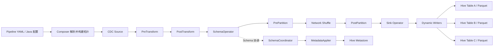
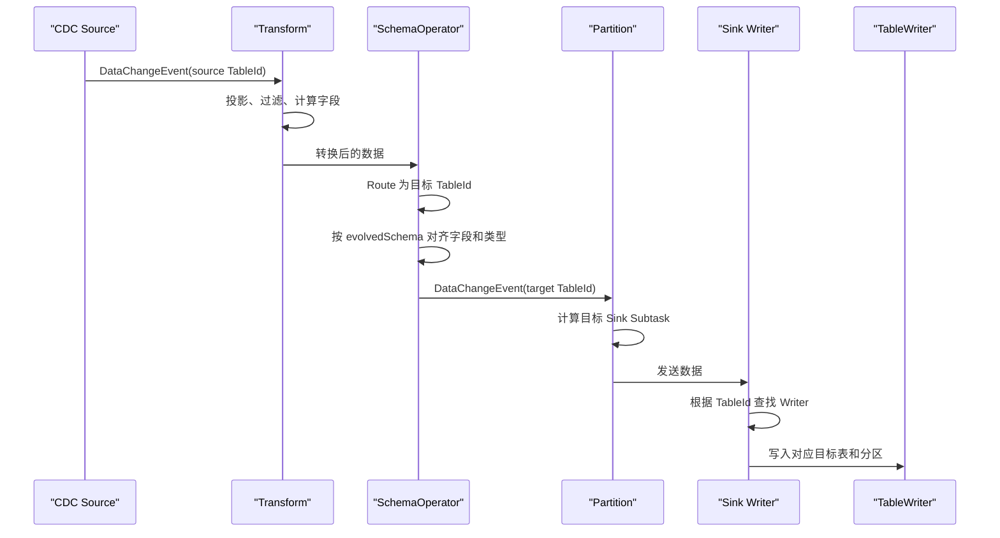
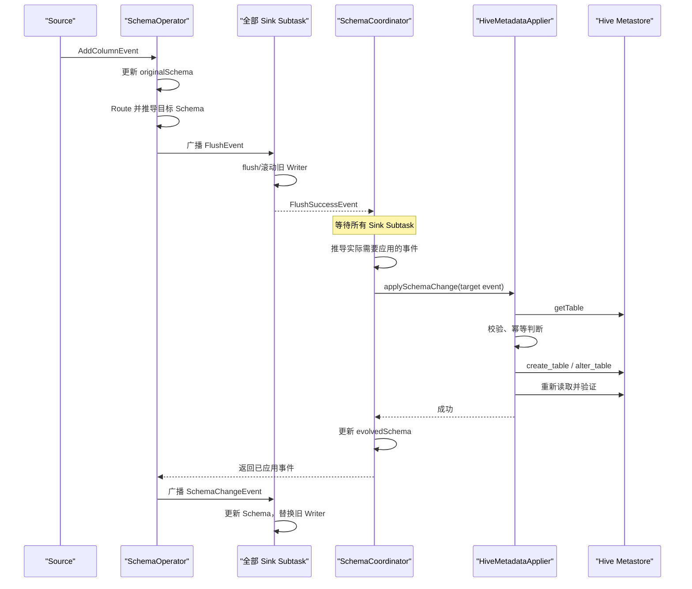
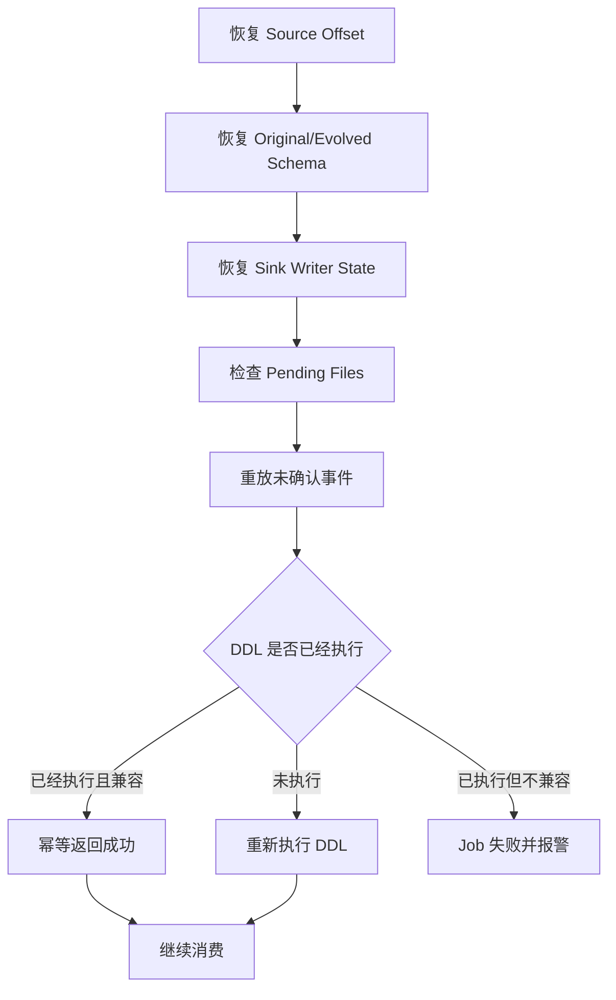
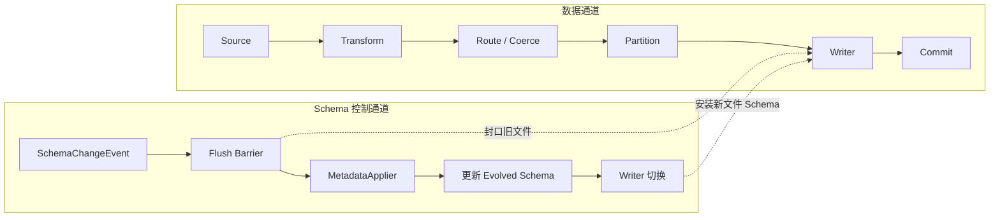

# Flink CDC Pipeline 3.6 完整流程

> 适用范围：Flink CDC 3.6 普通流式 Pipeline。Connector 的具体能力仍需以所用版本和目标系统为准。

## 1. 核心结论

Pipeline 是一个 Flink Job。Composer 根据 Pipeline 配置生成一套包含 Source、Transform、SchemaOperator、Partition 和 Sink 的算子拓扑，并以一个 JobId 提交。

它通常不是为每张业务表分别生成一套 Source/Sink，而是：

```text
一个 Pipeline 配置
  → 一个 Flink Job / JobId
  → 一套可以处理多张表的算子链
  → 多个并行 Source/Sink Subtask
  → 每个 Sink Subtask 内维护多个动态 Writer
```

一个 Source Connector 可以订阅多张表，一个 Sink Connector 可以写多张目标表。“多表”不等于“多个异构 Source/Sink 系统”。

## 2. Pipeline 整体架构



普通 Source 的标准拓扑为：

```text
Source
  → PreTransform
  → PostTransform
  → SchemaOperator
  → PrePartition
  → Network Shuffle
  → PostPartition
  → Sink
```

对于 `isParallelMetadataSource=true` 的 Source，Pipeline 会使用分布式 Schema 拓扑，Partitioning 与 SchemaOperator 的相对位置会变化，用于协调多个 Source Subtask 产生的元数据事件。

## 3. Composer 构建作业

Composer 只负责解析配置和组装 Flink 拓扑，不负责执行 Hive DDL、写 Parquet 文件或管理具体 Writer。

完整构建步骤：

1. 解析 YAML 或 Java 配置，生成 `PipelineDef`。
2. `PipelineDef` 包含 Source、Sink、Transform、Route 和 Pipeline 级参数。
3. 通过 Connector Factory 创建 `DataSource` 和 `DataSink`。
4. 从 `DataSink` 获取数据写入、元数据变更和数据分区三类能力。
5. 使用各类 Translator 生成 DataStream 算子拓扑。
6. 配置并行度、Schema Evolution 策略、算子 UID 和运行模式。
7. 调用 Flink 执行环境提交完整拓扑，获得一个 JobId。

`DataSink` 的三类核心能力是：

| 能力 | 作用 |
|---|---|
| `EventSinkProvider` | 创建真正写数据的 Sink |
| `MetadataApplier` | 将目标 Schema 变化应用到外部系统 |
| `HashFunctionProvider` | 决定数据进入哪个 Sink Subtask |

## 4. Pipeline 中的统一事件

Pipeline 内部主要传输以下事件：

| 事件 | 含义 |
|---|---|
| `CreateTableEvent` | 提供一张表的完整初始 Schema，是后续处理的基础 |
| `DataChangeEvent` | 表示 INSERT、UPDATE、REPLACE、DELETE |
| `SchemaChangeEvent` | 表示新增字段、删字段、改名、改类型、删表等结构变化 |
| `FlushEvent` | Schema 变化前建立写入边界，要求 Sink flush 旧数据 |

`CreateTableEvent` 不一定表示源库刚执行了建表，也可能是 Pipeline 启动后通知下游当前完整表结构。

## 5. Source 阶段

Source 负责：

- 读取初始快照；
- 持续读取 binlog、WAL 等增量日志；
- 保存并恢复日志位点；
- 生成统一的 CDC Event；
- 捕获源端 Schema 变化。

一条 `DataChangeEvent` 通常包含：

```text
TableId
before
after
OperationType
metadata
```

Source 表数量不会直接决定有多少 Source 算子。一个 Source Connector 可以订阅多库多表，并通过并行 Reader 或 Snapshot Split 提高采集并行度。

## 6. Transform 阶段

Transform 分为 PreTransform 和 PostTransform，负责：

- 字段投影；
- 字段改名；
- 表达式计算；
- 数据过滤；
- 类型转换；
- 元数据字段落列；
- 主键、分区键等逻辑 Schema 调整。

因此，目标 Hive Schema 应以 Transform 后的 Schema 为准，不一定等于源数据库的原始表结构。

例如源表增加了一个字段，但该字段未进入 Transform 投影，则该字段不一定需要出现在目标 Hive 表中。

## 7. SchemaOperator、Route 与两套 Schema

SchemaOperator 是 Pipeline 的核心控制节点，维护两套 Schema。

### 7.1 Original Schema

```java
Map<TableId, Schema> originalSchemaMap;
```

表示源表经过 Transform 后的最新 Schema。源端 Schema 已经变化时，即使 Sink 最终不能应用，Original Schema 仍需要更新。

### 7.2 Evolved Schema

```java
Map<TableId, Schema> evolvedSchemaMap;
```

表示目标系统已经成功应用的 Schema。普通数据进入下游前，需要根据 Original Schema 和 Evolved Schema 做字段、顺序和类型适配。

### 7.3 Route

Route 将源 `TableId` 映射成目标 `TableId`：

```text
business.orders → ods.ods_orders
```

如果一个源表在 `ALL_MATCH` 模式下匹配多个 Route，可以生成多个目标表事件，但它们通常仍属于同一种 Sink Connector，而不是同时写多个异构目标系统。

多个分片表合并到一张目标表时：

```text
mysql_shard_01.orders ─┐
                       ├─→ ods.orders
mysql_shard_02.orders ─┘
```

SchemaOperator 还要处理字段缺失、类型提升、DDL 到达顺序和字段冲突，不能简单采用最后到达的 Source Schema。

## 8. 普通 DataChangeEvent 流程



具体步骤：

1. Source 从快照或增量日志生成 `DataChangeEvent`。
2. Transform 执行投影、过滤、字段计算和 Schema 转换。
3. SchemaOperator 查找源端 Original Schema。
4. Route 将源 TableId 转换为目标 TableId。
5. SchemaOperator 按目标 Evolved Schema 对齐字段和类型。
6. Partitioning 计算目标 Sink Subtask。
7. SinkWriter 按目标表、分区、Bucket 和 Schema 版本选择 Writer。
8. Writer 将 CDC 数据转换为 Parquet Record，写入 in-progress 文件。
9. Checkpoint 成功后，Committer 提交 pending 文件。
10. 新 Hive 分区通常由 PartitionCommitter 注册。

普通数据事件不会调用 `MetadataApplier`。

## 9. Partitioning

Partitioning 包括：

```text
PrePartition
  → Network Shuffle
  → PostPartition
```

对 `DataChangeEvent`，Sink 提供的 HashFunction 决定目标 Subtask。主键表通常要保证同一目标表、同一主键的事件进入相同 Subtask，从而维持更新顺序。

Hive Parquet Sink 还可能将 TableId、Hive Partition 和 Bucket 纳入路由，减少多个 Subtask 同时写同一物理分区的问题。

SchemaChangeEvent 和 FlushEvent 通常需要广播，因为每个 Sink Subtask 都可能持有该表的 Writer 或 Schema 缓存。

## 10. Sink 与动态 Writer

一个 Sink Subtask 内部可以维护多层 Writer：

```text
Sink Subtask
  ├── Table A
  │   ├── Partition P1 / Bucket B1 / Schema V1 Writer
  │   └── Partition P2 / Bucket B1 / Schema V2 Writer
  ├── Table B
  │   └── Partition P1 / Bucket B2 / Schema V3 Writer
  └── Table C
      └── Partition P1 / Bucket B1 / Schema V1 Writer
```

Writer Key 通常至少包含：

```text
TableId + PartitionSpec + BucketId + SchemaVersion
```

生产实现必须控制：

- 最大活跃 Writer 数；
- 文件句柄和内存占用；
- LRU 或空闲 Writer 淘汰；
- 按时间、文件大小、Checkpoint 滚动；
- Schema 变化时滚动文件；
- 小文件数量与后续 Compaction。

Sink 的作用不是向多个不同系统分发，而是在同一种 Sink Connector 中，根据 TableId 等信息找到对应目标表的动态 Writer。

## 11. SchemaChangeEvent 完整协调流程



完整顺序：

1. Source 产生源表 `SchemaChangeEvent`。
2. SchemaOperator 更新 Original Schema。
3. Pipeline 根据 Transform、Route、多源合表结果和 Schema 策略推导目标事件。
4. SchemaOperator 向下游广播 `FlushEvent`。
5. Sink Operator 调用 SinkWriter 的 `flush(false)`。
6. 自定义 Sink 必须让旧 Parquet Writer 真正封口，不能只清空内存缓冲。
7. 所有 Sink Subtask 返回 `FlushSuccessEvent`。
8. SchemaCoordinator 等待全部 Sink Subtask 完成 flush。
9. Coordinator 调用 `MetadataApplier.applySchemaChange(targetEvent)`。
10. MetadataApplier 修改目标系统表结构，并重新读取验证结果。
11. 只有外部 DDL 成功后，SchemaManager 才更新 Evolved Schema。
12. SchemaOperator 将实际应用成功的 SchemaChangeEvent 广播给 Sink。
13. Sink 更新 Schema 缓存并淘汰旧 Writer。
14. 下一条数据按照新 Schema 创建新 Writer。

关键边界：

```text
旧 Writer flush/封口
  → 目标系统 DDL
  → Sink 安装新 Schema
  → 创建新 Writer
  → 写入新 Schema 数据
```

Parquet Writer 的文件 Schema 在创建时已经固定，不能在同一个打开的 Parquet 文件中原地修改 Schema。

## 12. HiveMetadataApplier 的位置

`HiveMetadataApplier` 是 Schema 控制面的一个组件，只负责把目标端 Schema 事件应用到 Hive Metastore：

```text
SchemaCoordinator
  → HiveMetadataApplier
  → Hive Metastore getTable/createTable/alter_table
```

它不负责：

- 写 Parquet 数据；
- 维护动态 Writer；
- 提交文件；
- 注册每个 Hive 分区；
- 回补历史字段；
- 自动实现 UPDATE/DELETE/UPSERT。

生产实现必须具备幂等性。典型情况是 Metastore 已经成功新增字段，但 RPC 响应超时；Job 重启后重放相同事件，此时字段已存在且类型一致应按成功处理，类型不一致则必须报告冲突。

## 13. Schema Evolution 策略

`pipeline.schema.change.behavior` 的主要模式：

| 模式 | 含义 |
|---|---|
| `exception` | 捕获 Schema 变化后直接失败 |
| `evolve` | 要求应用到 Sink，失败则作业失败 |
| `try_evolve` | 尝试应用；Sink 明确不支持时可继续并适配后续数据 |
| `lenient` | 将危险变化转换为尽量不丢数据的兼容变化，3.6 默认模式 |
| `ignore` | 不修改目标 Schema，后续数据尽量适配现有结构 |

对只安全支持 `CREATE_TABLE + ADD nullable column` 的 Hive/Parquet Sink，生产初期宜使用明确白名单，让删除、改名、类型修改和分区键修改进入失败或人工迁移流程。

## 14. Checkpoint 与故障恢复

Checkpoint 需要覆盖：

- Source 的快照进度和日志位点；
- SchemaOperator 的 Original/Evolved Schema；
- Sink Writer 状态；
- in-progress/pending 文件；
- Committer 待提交状态。



Hive Metastore DDL 是外部副作用，不会因为 Flink Checkpoint 回滚而自动撤销。因此，DDL 与文件提交不是一个事务，MetadataApplier 必须支持事件重放和幂等验证。

## 15. 数据通道与控制通道



两条通道的职责：

```text
数据通道：决定数据写到哪里，以及文件如何提交
控制通道：决定接下来应该按照什么表结构写
FlushEvent：在 Schema 变化点建立有序边界
```

## 16. 模块职责边界

| 模块 | 职责 |
|---|---|
| Composer | 解析配置并组装一个 Flink Job 拓扑 |
| Source | 读取快照和增量日志，生成统一 Event |
| Transform | 改变行、列和逻辑 Schema |
| SchemaOperator/Coordinator | 路由、Schema 推导、Flush 屏障和全局协调 |
| MetadataApplier | 修改 Hive Metastore 表定义 |
| SinkWriter | 按 TableId 管理动态 Writer 和 Schema 缓存 |
| ParquetTableWriter | 按固定物理 Schema 写具体文件 |
| Committer | 按 Checkpoint 安全提交文件 |
| PartitionCommitter | 注册 Hive 分区 |
| Backfill/Compaction | 回补历史字段、处理更新删除和小文件 |

## 17. 生产中容易遗漏的边界

1. `flush(false)` 不天然等于 Checkpoint 成功。
2. Hive Metastore DDL 与 Parquet 文件提交不是同一个事务。
3. Hive 表新增字段不会重写历史 Parquet 文件，历史值通常读取为 `NULL`。
4. 创建 Hive 分区表不等于注册每个新分区。
5. 多 Source 合入一表时，需要处理字段冲突、类型合并和 DDL 顺序。
6. `synchronized` 只能保护一个 JVM 实例，不能防止多个 Job 或人工 DDL 并发修改。
7. Hive 表中记录主键不会让普通 Parquet 自动支持 UPDATE/DELETE/UPSERT。
8. MetadataApplier 的运行节点必须具备 HMS 网络、认证和 DDL 权限。
9. Hive/Hadoop/Parquet 依赖必须与实际集群发行版兼容。
10. 动态 Writer 必须限制数量，否则容易出现文件句柄、内存和小文件问题。
11. Schema Evolution 不会自动进行历史数据回补。
12. 普通 External Parquet 表无法提供表格式级别的 Schema 与文件事务；强事务场景应评估 Iceberg、Paimon 或 Hudi。

## 18. 最终心智模型

```text
一个 JobId
  ├── 一套多表数据算子链
  ├── 多个并行 Source/Sink Subtask
  ├── 每个 Sink Subtask 内维护多个动态 Writer
  └── 一个 Schema 协调控制面

Composer 负责组装作业
MetadataApplier 负责修改目标元数据
SinkWriter 负责动态 Writer
Committer 负责安全提交文件
PartitionCommitter 负责注册 Hive 分区
```

不能只实现 `HiveMetadataApplier` 就认为 Hive CDC Sink 已经完整。完整生产链路至少还需要动态 Writer、Schema 版本状态、Checkpoint Committer、分区注册、恢复幂等、Writer 数量控制、监控告警和人工 Schema 迁移兜底。
