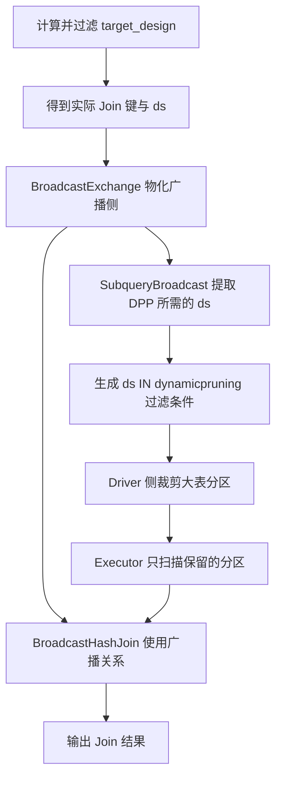

---
aliases:
  - Spark DPP
  - Dynamic Partition Pruning
  - SubqueryBroadcast
tags:
  - spark
  - spark-sql
  - dpp
  - partition-pruning
  - broadcast-join
status: active
---

# Spark 动态分区裁剪 DPP 与 SubqueryBroadcast

返回：[[30-计算与SQL开发/32-Spark/00-Spark知识地图|Spark 知识地图]]

## 核心结论

`SubqueryBroadcast` 是 Spark 为动态分区裁剪（Dynamic Partition Pruning，DPP）生成的内部物理执行节点。它不是 SQL 中可直接调用的 Join 类型，也不是 `BROADCAST` Hint 的另一种写法。

DPP 要解决的问题是：**大表按某列分区，但查询开始前只知道另一侧过滤后的结果，无法提前写死要读哪些分区。** Spark 先计算 Join 另一侧实际出现的分区键，再把这些值变成大表扫描节点上的运行时过滤条件，从而少枚举、少读取无关分区。

一句话理解：

> `BROADCAST` Hint 主要影响 Join 策略；`SubqueryBroadcast` 为 DPP 提供运行时分区值；`BroadcastHashJoin` 才是真正执行两表关联的算子。

## 典型 SQL 场景

![[99-images/Spark-DPP-Broadcast-Hint与ds连接条件.png|900]]

一类典型查询是：事实表按 `ds` 分区，与过滤后的数据集同时按业务主键和 `ds` 关联。其关键结构可简化为：

```sql
SELECT /*+ BROADCAST(target_design) */
       d.design_id,
       d.account_id,
       d.ds
FROM (
    SELECT design_id, account_id, ds
    FROM kdw_dw.dwd_cntnt_project_design_s_d
    WHERE ds BETWEEN '${start_ds}' AND '${end_ds}'
      AND root_account_id IN (...)
) d
INNER JOIN (
    SELECT DISTINCT original_design_id, ds
    FROM (...)
    WHERE original_design_id IS NOT NULL
) target_design
  ON d.design_id = target_design.original_design_id
 AND d.ds = target_design.ds
DISTRIBUTE BY d.ds;
```

这里有两个不同层次的过滤：

1. `d.ds BETWEEN ...` 是**静态分区裁剪**。日期范围在规划阶段已经明确，Spark 可以先排除范围外的分区。
2. `d.ds = target_design.ds` 为 DPP 提供了条件。`target_design` 经过过滤后究竟包含哪些 `ds`，要等它运行后才知道；Spark 再用这些实际值继续缩小大表侧的分区范围。

例如静态条件覆盖 30 天，但 `target_design` 最终只出现 3 个日期，理想情况下大表只需要读取这 3 天的分区，而不是 30 天全部分区。

是否能够通过 `ds` 做动态分区裁剪，最终仍取决于大表是否以 `ds` 作为物理分区列。应通过建表语句或 `DESCRIBE FORMATTED` 核对，不能只根据字段名称判断。

## 执行计划怎么读

![[99-images/Spark-DPP-SubqueryBroadcast执行计划.png|700]]

执行计划通常能看到类似结构：

```text
FileScan dwd_cntnt_project_design_s_d
PartitionFilters:
  dynamicpruningexpression(ds IN dynamicpruning#123)

SubqueryBroadcast dynamicpruning#123
+- BroadcastExchange

BroadcastHashJoin [...], [...], Inner, BuildRight
```

各节点职责不要混淆：

| 节点或表达式 | 职责 | 是否真正执行 Join |
|---|---|---|
| `dynamicpruningexpression(...)` | 挂在大表扫描上的运行时分区过滤条件 | 否 |
| `SubqueryBroadcast` | 从过滤侧的子查询或可复用广播结果中取得 DPP 所需的键 | 否 |
| `BroadcastExchange` | 物化并广播构建侧关系；在可复用时可同时服务 DPP 和广播 Join | 否 |
| `BroadcastHashJoin` | Executor 使用本地广播关系与流式一侧做哈希连接 | 是 |
| `FileScan` | 在分区过滤生效后读取保留下来的分区和文件 | 否 |

因此，看到 `SubqueryBroadcast` 不能推出“查询使用了一种叫 SubqueryBroadcast 的 Join”。真正的 Join 类型仍要看 `BroadcastHashJoin`、`SortMergeJoin` 或其他 Join 节点。

## 完整运行过程



更准确地说，Spark 不一定为了 DPP 再独立广播一份数据。当 Join 本身已经选择 Broadcast Hash Join 且交换复用可用时，DPP 可以复用同一个广播交换结果，并从中投影出所需的分区键。若无法复用，Spark 会根据版本、配置和收益估算决定保留重复子查询，还是直接删除 DPP 过滤器。

## DPP 的常见触发条件

DPP 不是只要写了 Join 就一定出现，通常需要同时满足：

- 已启用 `spark.sql.optimizer.dynamicPartitionPruning.enabled`；Spark 3.0 起该配置默认是 `true`。
- 被裁剪一侧是分区表，且 Join 键能够追溯到它的分区列；示例中对应 `d.ds`。
- 另一侧能产生用于裁剪的键，并且通常存在有选择性的过滤条件。
- Join 类型允许安全地裁剪对应一侧。常见支持场景包括 Inner、Left Semi，以及只裁剪非保留侧的 Left Outer / Right Outer。
- 优化器判断可以复用广播结果，或认为“少读分区”的收益高于额外执行子查询的成本。

`/*+ BROADCAST(target_design) */` **不是触发 DPP 的必要条件**。它提高了 `target_design` 被选为广播构建侧的优先级，从而可能让 DPP 复用广播结果，但 DPP 也可能在没有 Broadcast Hint 的计划中出现。

## 静态分区裁剪、DPP、数据过滤的区别

| 机制 | 过滤值何时已知 | 过滤对象 | 示例 |
|---|---|---|---|
| 静态分区裁剪 | 优化或规划阶段 | 分区目录 | `WHERE ds = '2026-09-19'` |
| 动态分区裁剪 DPP | 运行时先计算 Join 另一侧 | 分区目录或支持运行时过滤的数据源 | `fact.ds = dim.ds`，且 `dim` 还有过滤条件 |
| 普通谓词下推 | 规划后下推到数据源 | 文件内的行、Row Group 等 | `amount > 100` |
| Join 过滤 | 两侧数据已经进入 Join 算子 | 行 | `fact.id = dim.id` |

DPP 是**避免读取分区**，不只是让 Join 少输出几行。如果分区已经全部读入，再在 Join 中过滤，I/O 成本已经发生。

## SQL 设计要点

### 1. `ds` 必须出现在 Join 条件中

如果只保留：

```sql
d.design_id = target_design.original_design_id
```

而没有：

```sql
d.ds = target_design.ds
```

Spark 无法根据另一侧的 `ds` 推导应该裁剪大表的哪些日期分区。`design_id` 能完成业务关联，不代表它能裁剪按 `ds` 划分的物理分区。

### 2. Broadcast Hint 与 DPP 是互补关系

Hint 影响的是“如何 Join”，DPP 影响的是“Join 之前读哪些分区”。这类查询可能同时得到两种收益：

- `target_design` 较小时，用 Broadcast Hash Join 避免大表侧 Shuffle。
- `target_design` 只覆盖少数 `ds` 时，用 DPP 避免扫描大表的其他日期分区。

二者互补，但不是同一个优化。

### 3. `DISTINCT` 有收益也有成本

`SELECT DISTINCT original_design_id, ds` 可以减少重复 Join 键，降低广播数据量和重复匹配风险；但 `DISTINCT` 本身通常需要聚合和 Shuffle。应在 Spark UI 中比较去重前后的数据量、Shuffle 和总耗时，不能只看广播侧变小就断言一定更快。

### 4. DPP 不一定有明显收益

下面几种情况即使计划中出现 DPP，收益也可能很小：

- `target_design` 最终几乎包含日期范围内的所有 `ds`。
- 大表分区很少，或单个分区本来就很小。
- 获取 DPP 键的子查询本身很昂贵，且无法复用 Join 的广播交换。
- 分区数量或动态键数量过多，Driver 侧分区枚举与元数据处理成本上升。
- 对分区列包裹复杂函数、UDF 或不兼容的类型转换，导致优化器无法可靠追踪列血缘。

### 5. `DISTRIBUTE BY d.ds` 不负责触发 DPP

查询末尾的 `DISTRIBUTE BY d.ds` 作用在 Join 结果上，用于让相同 `ds` 的输出数据进入同一 Shuffle 分区，常用于控制写表时的数据分布。它通常会带来一次结果侧 Shuffle。

它和扫描前的 DPP 处于不同阶段：

- `d.ds = target_design.ds` 配合分区表结构，帮助 Spark 在输入侧做动态分区裁剪。
- `DISTRIBUTE BY d.ds` 调整 Join 之后的输出分布。

因此，删除 `DISTRIBUTE BY` 不必然让 DPP 消失；保留它也不代表 DPP 一定生效。

## 如何验证 DPP 真的生效

### 1. 看物理计划

```sql
EXPLAIN FORMATTED
SELECT ...;
```

重点找：

```text
PartitionFilters: [... dynamicpruningexpression(...)]
SubqueryBroadcast dynamicpruning#...
```

再单独确认真正的 Join 节点是 `BroadcastHashJoin`、`SortMergeJoin` 还是其他类型。

### 2. 看 Spark SQL UI

重点比较扫描节点的：

- 实际读取的分区数。
- 输入文件数和输入字节数。
- Scan 耗时与元数据枚举耗时。
- 广播侧的数据大小和广播耗时。
- 最终计划与初始计划是否不同（启用 AQE 时）。

计划中出现 `SubqueryBroadcast` 只能证明 Spark 生成了 DPP 支路；要证明它带来了性能收益，还要确认读取分区数和输入字节确实下降。

### 3. 做开关对照实验

在测试环境对同一份固定数据分别运行：

```sql
SET spark.sql.optimizer.dynamicPartitionPruning.enabled=true;
```

和：

```sql
SET spark.sql.optimizer.dynamicPartitionPruning.enabled=false;
```

对比前先保证两次结果行数与关键指标一致，再比较扫描分区数、输入字节和总耗时。避免把缓存、并发资源变化或 AQE 的其他改写误认为 DPP 收益。

## DPP 与 AQE 的关系

DPP 和 AQE 都会利用运行时信息，但关注点不同：

- DPP：在大表扫描前，用 Join 另一侧产生的键减少要读取的分区。
- AQE：在 Shuffle/Broadcast Query Stage 物化后，根据真实统计调整后续计划，例如合并 Shuffle 分区、处理倾斜、转换 Join 策略。

二者可以同时出现。看到 `AdaptiveSparkPlan` 不等于一定启用了 DPP；看到 `SubqueryBroadcast` 也不等于 AQE 已把 Join 动态转换为 Broadcast Hash Join。应分别看分区过滤表达式、Query Stage 和最终 Join 节点。

## 排查清单

- 大表是否真的按 Join 中的列分区？
- `PartitionFilters` 中是否出现 `dynamicpruningexpression`？
- 动态键来自哪一侧，过滤后还有多少个不同分区值？
- `SubqueryBroadcast` 是否复用了 Join 的 `BroadcastExchange`？
- 真正的 Join 节点是什么，构建侧是哪一边？
- 广播数据大小是否安全，是否有 Driver/Executor 内存或广播超时风险？
- DPP 后实际读取分区数、文件数和字节数是否下降？
- 是否同时存在静态分区条件，导致 DPP 的额外收益有限？
- `DISTINCT`、子查询或额外 Shuffle 的成本是否抵消了裁剪收益？

## 相关笔记

- [[30-计算与SQL开发/32-Spark/04-Spark执行模型、Join与AQE|Spark 执行模型、Join 与 AQE]]
- [[30-计算与SQL开发/32-Spark/性能优化/Spark 2.4 vs 3.2 Broadcast 行为差异|Spark 2.4 与 3.2 Broadcast 行为差异]]
- [[30-计算与SQL开发/32-Spark/性能优化/HashJoin和SortMergeJoin对比|Hash Join 和 Sort Merge Join 对比]]
- [[30-计算与SQL开发/32-Spark/性能优化/spark AQE 优化|Spark AQE 优化]]

## 参考资料

- [Apache Spark 配置：`spark.sql.optimizer.dynamicPartitionPruning.enabled`](https://spark.apache.org/docs/3.5.6/configuration.html)
- [Apache Spark 源码：`PartitionPruning` 的触发条件、广播复用与收益判断](https://github.com/apache/spark/blob/master/sql/core/src/main/scala/org/apache/spark/sql/execution/dynamicpruning/PartitionPruning.scala)
- [Apache Spark 源码：`DynamicPruningSubquery` 与 `DynamicPruningExpression`](https://github.com/apache/spark/blob/master/sql/catalyst/src/main/scala/org/apache/spark/sql/catalyst/expressions/DynamicPruning.scala)
- [Apache Spark 测试：DPP 的 `SubqueryBroadcastExec` 与交换复用验证](https://github.com/apache/spark/blob/master/sql/core/src/test/scala/org/apache/spark/sql/DynamicPartitionPruningSuite.scala)
